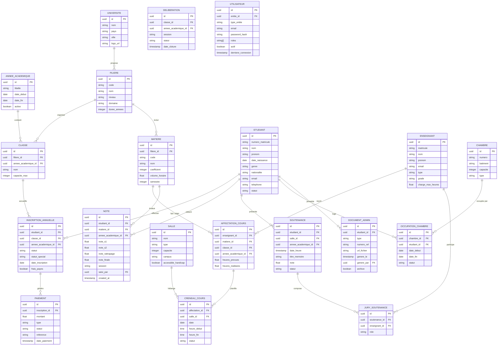
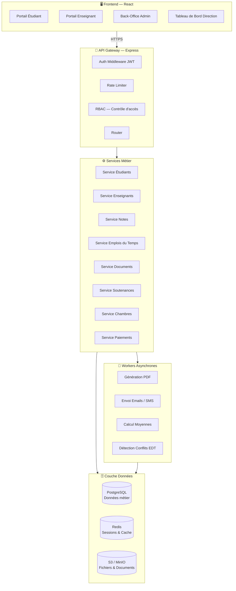
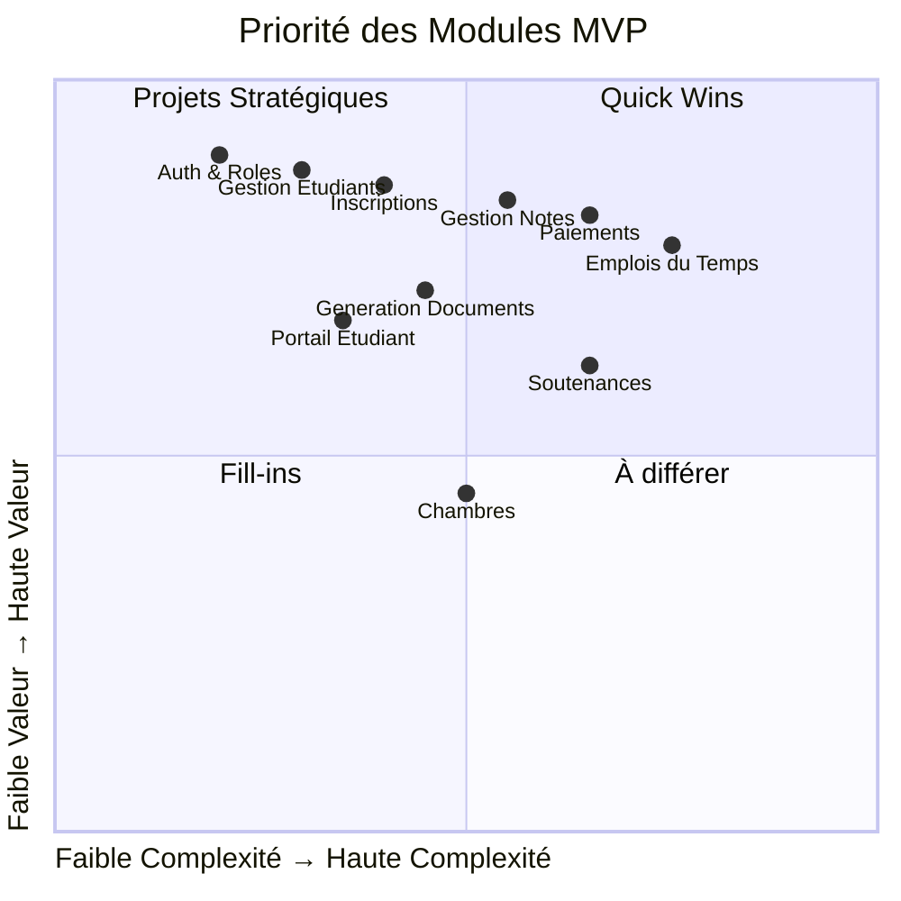
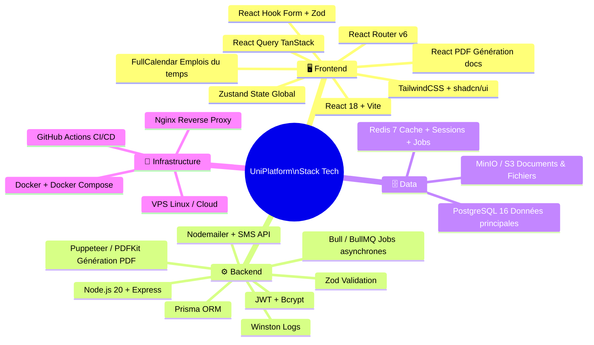
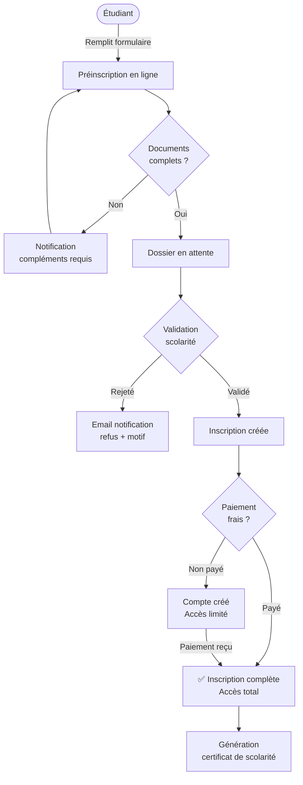
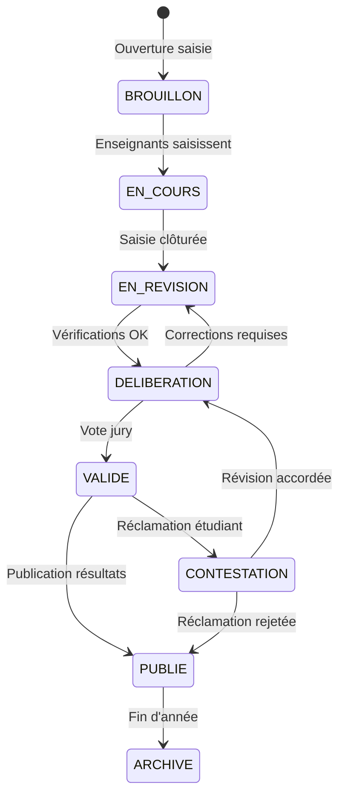
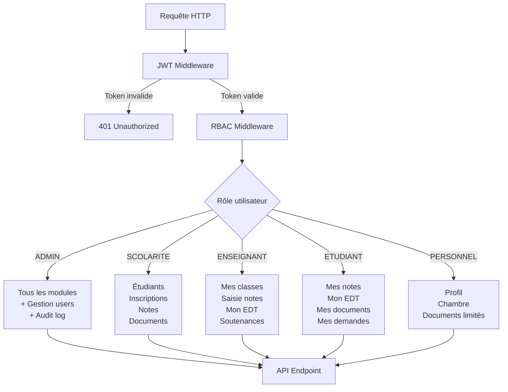
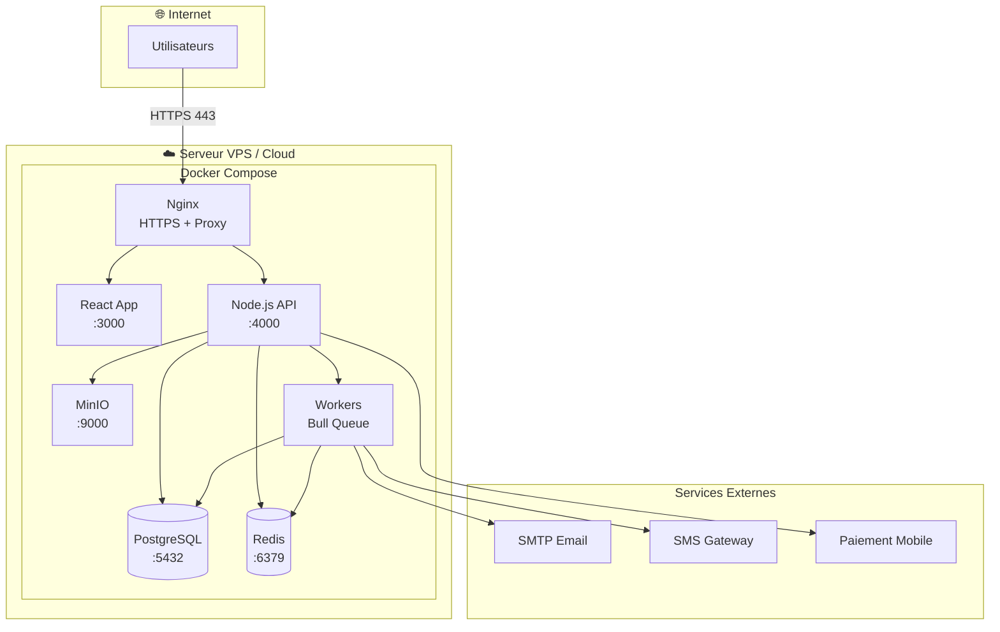
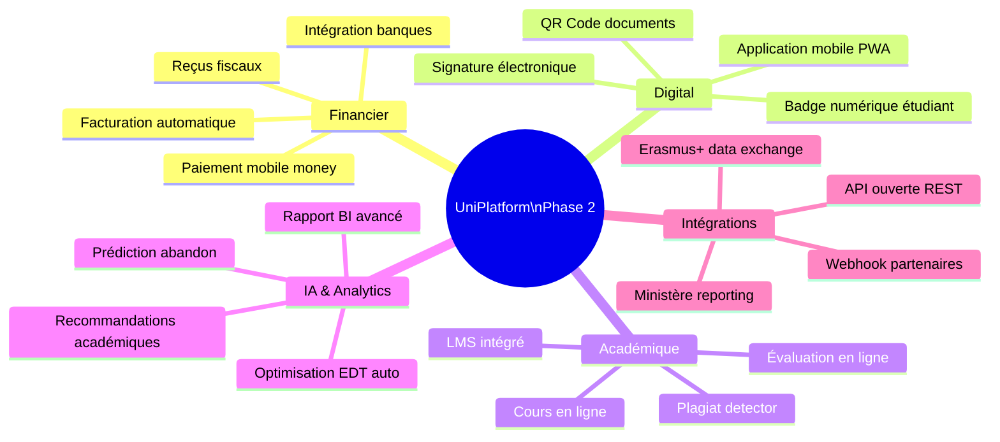

# 🎓 UniPlatform — Conception Complète du Projet
> **Plateforme de Gestion Universitaire Unifiée**  
> Stack : React · Node.js · PostgreSQL · Redis

---

## 🗺️ Table des Matières

1. [Vision & Périmètre](#vision)
2. [⚠️ Zones d'Ombre & Cas Non Couverts](#zones-ombre)
3. [Modèle de Données — Entités](#modele-donnees)
4. [Architecture Technique](#architecture)
5. [MVP Viable — Sprints Scrum](#mvp-scrum)
6. [Stack Technologique](#stack)
7. [Schémas Mermaid](#schemas)

---

## 🎯 Vision & Périmètre {#vision}

> Centraliser **100% des opérations** académiques, administratives et logistiques d'une université dans une seule plateforme moderne, accessible web et mobile.

**Valeur principale :**
- ✅ Une seule source de vérité pour toutes les données
- ✅ Zéro duplication entre services
- ✅ Traçabilité complète des actions
- ✅ Expérience fluide pour étudiants, enseignants et administration

---

## ⚠️ Zones d'Ombre & Cas Non Couverts {#zones-ombre}

> Ces situations **existent dans toute université réelle** mais sont souvent oubliées dans les spécifications initiales.

---

### 🔴 CRITIQUE — À traiter avant le MVP

#### 1. Transferts Inter-Établissements
Un étudiant arrive d'une autre université avec un **dossier académique partiel** : certaines matières validées, d'autres en équivalence. La structure actuelle ne gère pas :
- La **validation d'acquis** (VAE / VAP)
- Les **équivalences de matières** entre filières ou établissements
- Le **dossier hybride** (notes externes non saisies dans le système)

> 💡 **Solution** : Entité `TransfertAcademique` avec statut (en_attente, validé_partiel, refusé) et table `EquivalenceMatiere`.

---

#### 2. Étudiants en Situation Particulière
Situations non modélisées dans un schéma simple :
- **Double inscription** (étudiant inscrit dans 2 filières simultanément — rare mais légal dans certains systèmes)
- **Congé académique** (pause d'un an, conservation du numéro étudiant, sans inscription active)
- **Étudiant en mobilité entrante** (Erasmus, échange) : il suit des cours mais n'est pas diplômable dans l'établissement
- **Étudiant en mobilité sortante** : inscrit ici mais absent physiquement
- **Étudiant décédé** : le dossier doit être archivé, jamais supprimé, avec signalement

> 💡 **Solution** : Champ `statut_special` sur l'entité `InscriptionAnnuelle` + entité `MobiliteEtudiant`.

---

#### 3. Gestion des Conflits de Notes
- Un enseignant **modifie une note après délibération** → qui autorise ? quelle traçabilité ?
- **Réclamation étudiant** : processus de contestation formelle
- **Délibération de rattrapage** : notes de session 1 + session 2, calcul final
- **Note éliminatoire** (certains systèmes : si < X dans une matière, l'étudiant est éliminé même avec une bonne moyenne)

> 💡 **Solution** : `ModificationNote` avec workflow (demande → validation scolarité → délibération), `SessionExamen` (S1/S2/Rattrapage).

---

#### 4. Cas d'Usage des Emplois du Temps
La détection de conflits doit couvrir :
- Un enseignant **affecté à deux cours en même heure** dans deux campus différents
- Une salle utilisée pour un **cours + une soutenance** au même créneau
- Les **jours fériés locaux** et fermetures exceptionnelles
- Les **examens** qui nécessitent des salles plus grandes (regroupement de classes)
- **Remplacement d'un enseignant absent** : qui peut remplacer ? traçabilité

---

#### 5. Gestion Financière (souvent oubliée)
Non mentionnée dans les modules mais **vitale** pour toute université :
- **Frais de scolarité** : montant, échéances, réductions (bourses, fratrie)
- **Statut de paiement** : lien direct avec autorisation d'inscription / accès aux examens
- **Reçus et quittances** numériques
- **Étudiants boursiers** : suivi des bourses externes (état, institution privée)
- **Remboursements** en cas de désistement

> ⚠️ Sans ce module, un étudiant peut passer ses examens sans avoir payé. C'est un **risque opérationnel majeur**.

---

### 🟡 IMPORTANT — À traiter en Phase 2

#### 6. Gestion des Examens (≠ Notes)
La **saisie de notes** est prévue, mais pas la **logistique des examens** :
- Surveillance : qui surveille quelle salle ?
- **Convocations automatiques** aux examens
- **Gestion des absences aux examens** (justifiée, injustifiée → note 0 ou rattrapage)
- **Fraudes académiques** : signalement, procédure disciplinaire, archivage

---

#### 7. Ressources Humaines Enseignants
- **Contrats vacataires** : suivi des heures effectivement réalisées vs prévues pour **calcul de rémunération**
- **Fiche de paie** ou export vers un système RH externe
- **Absences enseignants** : congé maladie, formation → qui remplace ?
- **Évaluation des enseignants** par les étudiants

---

#### 8. Multi-Campus / Multi-Sites
Si l'université a plusieurs sites :
- Les salles sont liées à un **campus** (pas juste une salle générique)
- Les emplois du temps doivent tenir compte des **temps de déplacement** inter-campus
- Certains cours peuvent être **hybrides** (présentiel + distanciel)

---

#### 9. Historique et Versioning des Données Critiques
- Un changement de **filière** d'une matière → les étudiants anciens ont-ils leurs notes préservées ?
- **Renommage d'une filière** → l'historique doit rester lisible
- **Suppression d'un enseignant** → ses cours passés ne disparaissent pas

> 💡 **Pattern** : Soft delete systématique (`deleted_at`) + colonnes `valid_from` / `valid_to` sur les entités critiques.

---

#### 10. Accessibilité & Cas Légaux
- **RGPD** : droit à l'oubli vs obligation de conservation des données académiques (diplômes → conservés à vie)
- **Étudiants mineurs** : si l'établissement accueille des moins de 18 ans, des règles spécifiques s'appliquent
- **Étudiants en situation de handicap** : aménagements d'examens (tiers-temps, salle isolée), non modélisés

---

## 🗃️ Modèle de Données — Entités {#modele-donnees}

---

## 🏗️ Architecture Technique {#architecture}

---

## 🏃 MVP Viable — Sprints Scrum {#mvp-scrum}

> **Durée totale estimée : 10 sprints de 2 semaines = 5 mois**  
> Équipe cible : 2 devs frontend + 2 devs backend + 1 lead/archi + 1 PO

---

### 📋 Backlog Priorisé (MoSCoW)

---

### Sprint 0 — Fondations (2 semaines)
> 🎯 Objectif : Infrastructure prête, aucune fonctionnalité visible

| # | User Story | Points |
|---|-----------|--------|
| S0-1 | Setup projet React + Vite + TailwindCSS | 3 |
| S0-2 | Setup API Node.js/Express + structure modulaire | 3 |
| S0-3 | Setup PostgreSQL + migrations Prisma | 5 |
| S0-4 | CI/CD basique (GitHub Actions → staging) | 3 |
| S0-5 | Système d'authentification JWT + refresh token | 8 |
| S0-6 | Modèle RBAC (rôles : admin, scolarité, enseignant, étudiant) | 5 |

**Total : 27 points**

---

### Sprint 1 — Référentiel Académique (2 semaines)
> 🎯 Objectif : L'admin peut créer l'université, filières, années et classes

| # | User Story | Points |
|---|-----------|--------|
| S1-1 | CRUD Années Académiques | 3 |
| S1-2 | CRUD Filières & Niveaux | 5 |
| S1-3 | CRUD Classes (liées filière + année) | 5 |
| S1-4 | CRUD Matières avec coefficients et volumes horaires | 5 |
| S1-5 | Interface admin : navigation et layout de base | 5 |

**Total : 23 points**

---

### Sprint 2 — Gestion des Étudiants (2 semaines)
> 🎯 Objectif : Créer, importer et consulter les dossiers étudiants

| # | User Story | Points |
|---|-----------|--------|
| S2-1 | CRUD Étudiant avec génération auto du matricule | 5 |
| S2-2 | Import en masse via CSV | 8 |
| S2-3 | Fiche étudiant complète (infos + historique) | 5 |
| S2-4 | Recherche et filtres avancés | 5 |
| S2-5 | Gestion des statuts spéciaux (congé, mobilité, transfert) | 8 |

**Total : 31 points**

---

### Sprint 3 — Gestion des Enseignants & Personnel (2 semaines)
> 🎯 Objectif : Gérer tous les types d'intervenants

| # | User Story | Points |
|---|-----------|--------|
| S3-1 | CRUD Enseignants (permanents + vacataires) | 5 |
| S3-2 | Affectation enseignant → matière → classe | 5 |
| S3-3 | Suivi des charges horaires (prévu vs réalisé) | 8 |
| S3-4 | CRUD Personnel administratif | 3 |

**Total : 21 points**

---

### Sprint 4 — Inscriptions (2 semaines)
> 🎯 Objectif : Gérer le cycle complet d'inscription annuelle

| # | User Story | Points |
|---|-----------|--------|
| S4-1 | Campagne d'inscription par année académique | 5 |
| S4-2 | Préinscription en ligne (formulaire public) | 8 |
| S4-3 | Workflow de validation (en attente → validé/rejeté) | 8 |
| S4-4 | Rattachement étudiant → classe | 3 |
| S4-5 | Export liste officielle (PDF / Excel) | 5 |
| S4-6 | ⚠️ Lien paiement → validation inscription | 5 |

**Total : 34 points**

---

### Sprint 5 — Paiements (2 semaines)
> 🎯 Objectif : Suivre les paiements et bloquer les accès si non payé

| # | User Story | Points |
|---|-----------|--------|
| S5-1 | Paramétrage des frais par filière/niveau | 5 |
| S5-2 | Enregistrement des paiements (cash, mobile money) | 5 |
| S5-3 | Suivi statut paiement par étudiant | 3 |
| S5-4 | Génération de reçu numérique (PDF) | 5 |
| S5-5 | Blocage accès examen si paiement non validé | 8 |
| S5-6 | Rapport des impayés par classe / filière | 5 |

**Total : 31 points**

---

### Sprint 6 — Notes & Résultats (2 semaines)
> 🎯 Objectif : Saisie, calcul et validation des notes

| # | User Story | Points |
|---|-----------|--------|
| S6-1 | Interface saisie de notes par enseignant | 8 |
| S6-2 | Calcul automatique des moyennes pondérées | 8 |
| S6-3 | Workflow de délibération (draft → validé → publié) | 8 |
| S6-4 | Gestion session 1, session 2 et rattrapage | 5 |
| S6-5 | Modification de note avec traçabilité (qui, quand, pourquoi) | 8 |
| S6-6 | Relevé de notes généré en PDF | 8 |

**Total : 45 points**

---

### Sprint 7 — Emplois du Temps (2 semaines)
> 🎯 Objectif : Planification des cours avec détection de conflits

| # | User Story | Points |
|---|-----------|--------|
| S7-1 | CRUD Salles avec capacité et campus | 3 |
| S7-2 | Création manuelle de créneaux (enseignant + salle + matière) | 8 |
| S7-3 | Détection automatique des conflits (salle, enseignant, classe) | 13 |
| S7-4 | Vue calendrier pour étudiant et enseignant | 8 |
| S7-5 | Export PDF de l'emploi du temps | 5 |

**Total : 37 points**

---

### Sprint 8 — Documents Administratifs & Portail Étudiant (2 semaines)
> 🎯 Objectif : Génération automatique de documents + portail self-service

| # | User Story | Points |
|---|-----------|--------|
| S8-1 | Moteur de templates de documents (certificat, attestation) | 13 |
| S8-2 | Génération certificat de scolarité en 1 clic | 5 |
| S8-3 | Portail étudiant : notes, EDT, documents | 8 |
| S8-4 | Demande de document par l'étudiant + suivi | 5 |
| S8-5 | Numérotation automatique et archivage | 5 |

**Total : 36 points**

---

### Sprint 9 — Soutenances, Chambres & Dashboard (2 semaines)
> 🎯 Objectif : Compléter les modules logistiques + tableau de bord

| # | User Story | Points |
|---|-----------|--------|
| S9-1 | Planification des soutenances (salle, jury, étudiant) | 8 |
| S9-2 | Génération PV de soutenance | 5 |
| S9-3 | CRUD Chambres campus + affectation étudiants | 5 |
| S9-4 | Tableau de bord direction : KPIs principaux | 8 |
| S9-5 | Journal d'audit (audit log) | 5 |

**Total : 31 points**

---

### Sprint 10 — Stabilisation & Mise en Production (2 semaines)
> 🎯 Objectif : Tests, corrections, sécurité, documentation

| # | Tâche | Points |
|---|-------|--------|
| S10-1 | Tests d'intégration end-to-end | 8 |
| S10-2 | Audit de sécurité (OWASP) | 8 |
| S10-3 | Performance et optimisation requêtes DB | 5 |
| S10-4 | Documentation API (Swagger) | 5 |
| S10-5 | Formation et guide utilisateur | 5 |

**Total : 31 points**

---

## 💻 Stack Technologique {#stack}

---

## 📐 Schémas Mermaid Complémentaires {#schemas}

### Flux d'Inscription Étudiant

---

### Workflow de Délibération des Notes

---

### Architecture de Sécurité & RBAC

---

### Modèle de Déploiement

---

## 📊 Récapitulatif MVP

| Module | Sprint | Priorité | Effort |
|--------|--------|----------|--------|
| Auth & RBAC | Sprint 0 | 🔴 Must | 13 pts |
| Référentiel académique | Sprint 1 | 🔴 Must | 23 pts |
| Gestion Étudiants | Sprint 2 | 🔴 Must | 31 pts |
| Gestion Enseignants | Sprint 3 | 🔴 Must | 21 pts |
| Inscriptions | Sprint 4 | 🔴 Must | 34 pts |
| Paiements | Sprint 5 | 🔴 Must | 31 pts |
| Notes & Délibérations | Sprint 6 | 🔴 Must | 45 pts |
| Emplois du Temps | Sprint 7 | 🟡 Should | 37 pts |
| Documents & Portail | Sprint 8 | 🟡 Should | 36 pts |
| Soutenances & Dashboard | Sprint 9 | 🟢 Could | 31 pts |
| Stabilisation | Sprint 10 | 🔴 Must | 31 pts |

> **Total estimé : ~334 story points sur 20 semaines (5 mois)**

---

## 🚀 Évolutions Phase 2

---

*Document généré pour le projet UniPlatform — Version 1.0*  
*Stack : React · Node.js · PostgreSQL · Redis · Docker*
