# 📏 Règles de Gestion — UniPlatform
> Document de référence métier · Version 1.0  
> Toute règle est identifiée, catégorisée et traçable jusqu'au code.

---

## 📋 Table des matières

1. [Utilisateurs & Accès](#rg-acces)
2. [Années Académiques](#rg-annee)
3. [Filières, Classes & Matières](#rg-filiere)
4. [Étudiants](#rg-etudiant)
5. [Inscriptions](#rg-inscription)
6. [Enseignants](#rg-enseignant)
7. [Notes & Évaluation](#rg-notes)
8. [Emplois du Temps](#rg-edt)
9. [Salles](#rg-salle)
10. [Documents Administratifs](#rg-document)
11. [Soutenances](#rg-soutenance)
12. [Chambres du Campus](#rg-chambre)
13. [Traçabilité & Audit](#rg-audit)

---

## Conventions de notation

| Préfixe | Domaine |
|---|---|
| `RG-ACC` | Accès & Authentification |
| `RG-ACA` | Année Académique |
| `RG-FIL` | Filières & Classes |
| `RG-ETU` | Étudiants |
| `RG-INS` | Inscriptions |
| `RG-ENS` | Enseignants |
| `RG-NOT` | Notes & Résultats |
| `RG-EDT` | Emploi du Temps |
| `RG-SAL` | Salles |
| `RG-DOC` | Documents Administratifs |
| `RG-SOU` | Soutenances |
| `RG-CHM` | Chambres Campus |
| `RG-TRA` | Traçabilité |

> **Priorité** : 🔴 Bloquant · 🟠 Important · 🟡 Recommandé

---

## 🔐 1. Utilisateurs & Accès {#rg-acces}

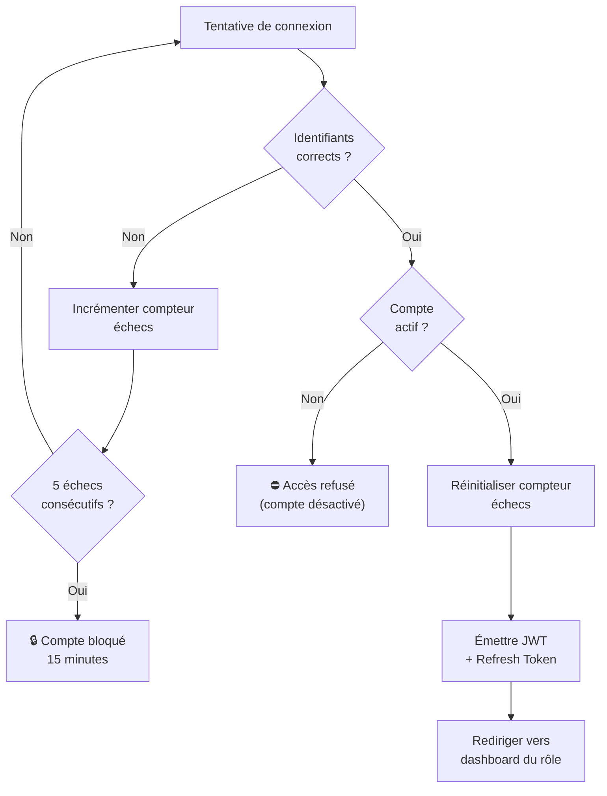

| ID | Règle | Priorité |
|---|---|---|
| `RG-ACC-001` | Chaque utilisateur possède **un seul rôle** parmi : `admin`, `scolarite`, `enseignant`, `etudiant`, `personnel`. | 🔴 |
| `RG-ACC-002` | Le mot de passe doit comporter **au minimum 8 caractères**, dont 1 majuscule, 1 chiffre et 1 caractère spécial. | 🔴 |
| `RG-ACC-003` | Le token JWT expire après **15 minutes**. Le refresh token expire après **7 jours**. | 🔴 |
| `RG-ACC-004` | Après **5 tentatives échouées** consécutives, le compte est verrouillé pendant **15 minutes** automatiquement. | 🔴 |
| `RG-ACC-005` | Le refresh token est stocké en **cookie HttpOnly** et ne doit jamais être exposé dans le corps de la réponse. | 🔴 |
| `RG-ACC-006` | Un utilisateur ne peut accéder qu'aux données de **son propre établissement** (multitenancy). | 🔴 |
| `RG-ACC-007` | Seul l'`admin` peut créer, modifier ou désactiver un compte utilisateur. | 🔴 |
| `RG-ACC-008` | La désactivation d'un compte ne supprime pas les données liées (notes, inscriptions, documents). | 🟠 |
| `RG-ACC-009` | Un étudiant ne peut consulter **que ses propres** notes, documents et emploi du temps. | 🔴 |
| `RG-ACC-010` | Un enseignant ne peut saisir des notes **que pour les classes et matières auxquelles il est affecté**. | 🔴 |
| `RG-ACC-011` | La scolarité peut lire et modifier tous les dossiers étudiants, mais ne peut pas valider les notes (réservé à la direction pédagogique). | 🟠 |
| `RG-ACC-012` | Toute action d'un utilisateur est **horodatée et journalisée** avec son identifiant. | 🔴 |

---

## 📅 2. Années Académiques {#rg-annee}

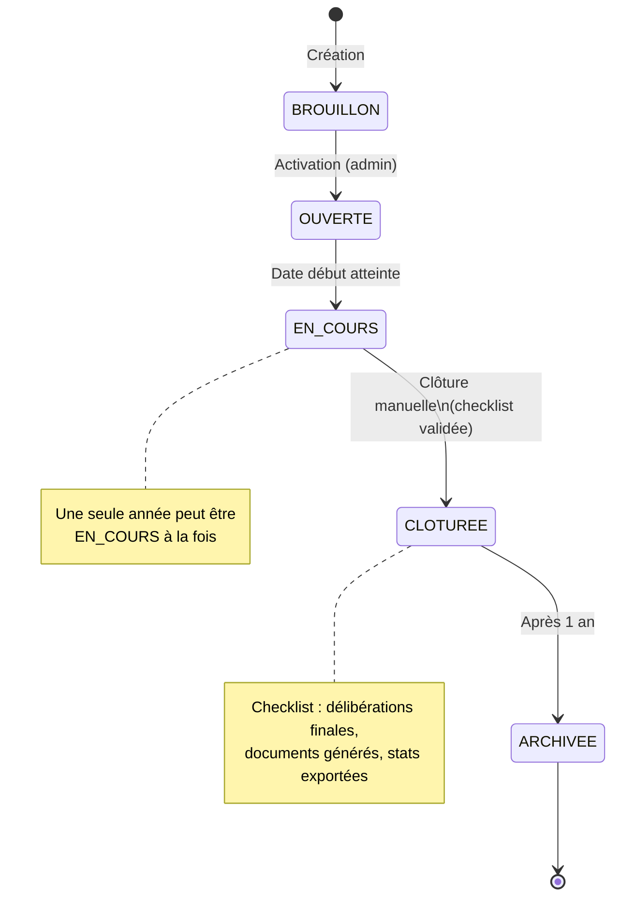

| ID | Règle | Priorité |
|---|---|---|
| `RG-ACA-001` | Il ne peut y avoir qu'**une seule année académique active** (`est_courante = true`) à la fois. | 🔴 |
| `RG-ACA-002` | Une année académique ne peut être **clôturée** que si toutes les délibérations sont finalisées et tous les résultats validés. | 🔴 |
| `RG-ACA-003` | La clôture d'une année déclenche une **checklist obligatoire** : notes validées ✔, relevés générés ✔, statistiques exportées ✔. | 🔴 |
| `RG-ACA-004` | Une année clôturée passe en **lecture seule** : aucune modification de notes ou d'inscriptions n'est possible. | 🔴 |
| `RG-ACA-005` | Le code d'une année académique suit le format `AAAA-AAAA` (ex : `2024-2025`). Il est **unique et non modifiable** après création. | 🟠 |
| `RG-ACA-006` | Une année académique est archivée automatiquement **12 mois après sa clôture**. Les données restent consultables. | 🟡 |
| `RG-ACA-007` | Les règles pédagogiques (coefficients, volumes horaires) sont **versionnées par année académique** et ne peuvent pas être modifiées rétroactivement. | 🔴 |

---

## 🏫 3. Filières, Classes & Matières {#rg-filiere}

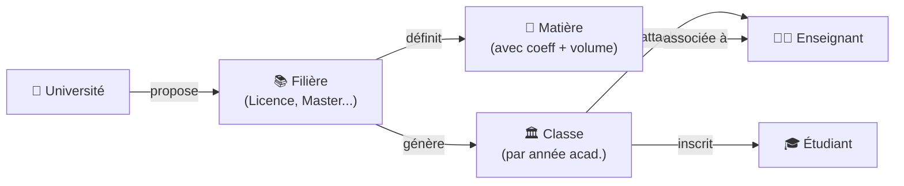

| ID | Règle | Priorité |
|---|---|---|
| `RG-FIL-001` | Le code d'une filière est **unique** au sein d'un établissement. | 🔴 |
| `RG-FIL-002` | Une filière définit les matières par niveau (ex. : niveau 1, 2, 3). Une matière appartient à **un seul niveau** d'une filière. | 🟠 |
| `RG-FIL-003` | Une classe est créée pour **une filière + un niveau + une année académique** précise. On ne peut pas créer deux classes identiques pour la même combinaison. | 🔴 |
| `RG-FIL-004` | La **capacité maximale** d'une classe doit être renseignée. Elle ne peut pas être inférieure à 1. | 🔴 |
| `RG-FIL-005` | Une matière peut être **mutualisée** entre plusieurs classes (cours communs). Dans ce cas, la relation est M:N entre matière et classe. | 🟠 |
| `RG-FIL-006` | Le **coefficient** d'une matière doit être supérieur à 0. La somme des coefficients d'un semestre est libre mais doit être cohérente (vérification à la délibération). | 🟠 |
| `RG-FIL-007` | Une matière supprimée est **archivée**, jamais effacée physiquement, car elle est référencée par des notes historiques. | 🔴 |
| `RG-FIL-008` | Les volumes horaires (CM, TD, TP) sont **indicatifs pour la planification** des emplois du temps, pas bloquants à la saisie. | 🟡 |

---

## 🎓 4. Étudiants {#rg-etudiant}

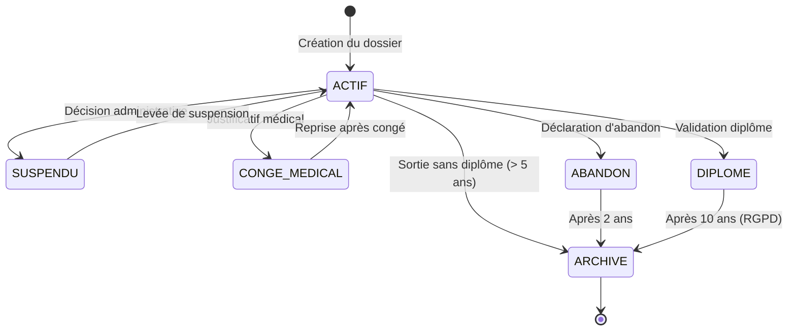

| ID | Règle | Priorité |
|---|---|---|
| `RG-ETU-001` | Le numéro étudiant est **généré automatiquement** par le système selon le format `[ANNEE][FILIERE][SEQUENCE]` (ex. : `2024INFO0042`). Il est **permanent et non recyclable**. | 🔴 |
| `RG-ETU-002` | La combinaison **(nom + prénom + date de naissance + lieu de naissance)** doit être unique. En cas de doublon potentiel, le système affiche une **alerte** et demande confirmation avant création. | 🔴 |
| `RG-ETU-003` | L'adresse email de l'étudiant est **unique** dans le système. | 🔴 |
| `RG-ETU-004` | Un changement de statut doit obligatoirement être accompagné d'un **motif** et est **tracé** dans l'historique. | 🔴 |
| `RG-ETU-005` | Un étudiant en statut `conge_medical` ne peut pas être inscrit à un cours ni recevoir de notes pendant la période de congé. | 🟠 |
| `RG-ETU-006` | Un étudiant en statut `suspendu` ne peut pas accéder au portail étudiant ni générer de documents. | 🟠 |
| `RG-ETU-007` | Un étudiant `diplome` ou `archive` passe en **lecture seule** : aucune modification de ses données académiques. | 🔴 |
| `RG-ETU-008` | La suppression physique d'un dossier étudiant est **interdite**. Seul l'archivage est autorisé. | 🔴 |
| `RG-ETU-009` | Un étudiant peut être autorisé à s'inscrire dans **deux filières simultanément** uniquement avec validation explicite de l'`admin`. | 🟠 |
| `RG-ETU-010` | Un transfert de filière génère un enregistrement dans la table `transferts_filiere` avec la date, le motif, et la classe d'origine. L'historique des notes de la filière précédente est conservé. | 🔴 |
| `RG-ETU-011` | Les données personnelles d'un étudiant archivé sont **anonymisées automatiquement** après 10 ans (conformité RGPD). Les données académiques (notes, résultats) restent accessibles à des fins d'archive officielle. | 🟠 |

---

## 📝 5. Inscriptions {#rg-inscription}

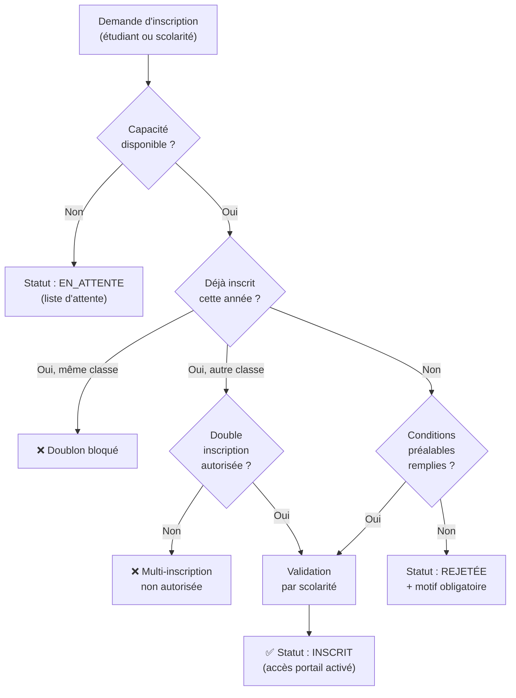

| ID | Règle | Priorité |
|---|---|---|
| `RG-INS-001` | Un étudiant ne peut être inscrit qu'**une seule fois** dans une même classe pour une année académique donnée. | 🔴 |
| `RG-INS-002` | Une inscription est possible uniquement si la classe n'a **pas atteint sa capacité maximale**. Sinon, l'inscription passe en `en_attente`. | 🔴 |
| `RG-INS-003` | Les statuts possibles d'une inscription sont : `en_attente`, `inscrit`, `rejetee`, `suspendue`. Chaque transition est tracée. | 🔴 |
| `RG-INS-004` | Une inscription `rejetee` doit obligatoirement comporter un **motif de rejet**. | 🔴 |
| `RG-INS-005` | Seule la `scolarite` ou l'`admin` peut valider, rejeter ou suspendre une inscription. | 🔴 |
| `RG-INS-006` | Une inscription `inscrit` donne automatiquement accès au portail étudiant et à l'emploi du temps de la classe. | 🟠 |
| `RG-INS-007` | Si un étudiant en `en_attente` est inscrit suite à une libération de place, il reçoit une **notification automatique**. | 🟡 |
| `RG-INS-008` | Il n'est pas possible de modifier une inscription d'une **année académique clôturée**. | 🔴 |
| `RG-INS-009` | Une inscription de session 2 (`RG-INS-009`) ne peut être créée que si l'étudiant possède une inscription de session 1 dans la même filière et année. | 🟠 |
| `RG-INS-010` | Un transfert de filière clôture l'inscription dans la classe d'origine (statut `suspendue`) et crée une nouvelle inscription dans la classe cible. | 🔴 |

---

## 👨‍🏫 6. Enseignants {#rg-enseignant}

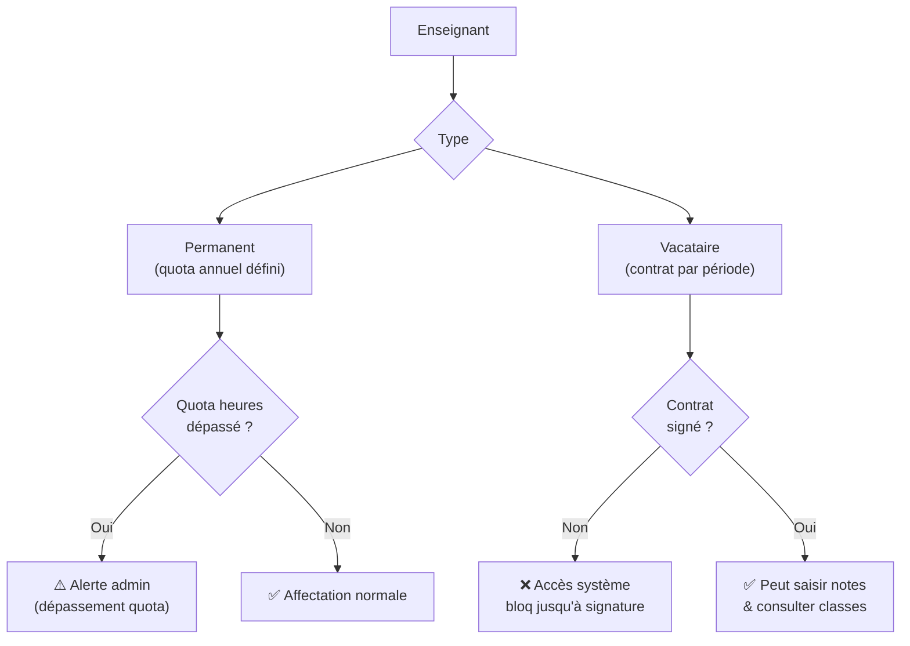

| ID | Règle | Priorité |
|---|---|---|
| `RG-ENS-001` | Le matricule enseignant est **unique** dans l'établissement et non modifiable. | 🔴 |
| `RG-ENS-002` | Un enseignant **vacataire** doit avoir un contrat enregistré et validé avant que son compte soit activé pour la saisie de notes. | 🔴 |
| `RG-ENS-003` | Un enseignant ne peut saisir des notes que pour les matières et classes pour lesquelles il possède une **affectation active** sur l'année académique courante. | 🔴 |
| `RG-ENS-004` | La **charge horaire** d'un enseignant permanent ne doit pas dépasser son `quota_heures_max`. Un dépassement déclenche une alerte sans bloquer (avec validation admin requise). | 🟠 |
| `RG-ENS-005` | Un enseignant peut être affecté à **plusieurs classes et matières**, y compris dans différentes filières. | 🟠 |
| `RG-ENS-006` | Lorsqu'un enseignant est en statut `conge`, ses classes apparaissent avec un **indicateur de remplacement** sur le tableau de bord de la scolarité. | 🟠 |
| `RG-ENS-007` | Un enseignant ne peut pas être **à la fois rapporteur et président** d'une même soutenance. | 🔴 |
| `RG-ENS-008` | Un enseignant doit **déclarer tout lien familial** avec un étudiant dont il assure l'enseignement ou le jury. La scolarité doit alors statuer. | 🔴 |
| `RG-ENS-009` | La suppression physique d'un enseignant est **interdite**. Il passe en statut `inactif`. Ses notes et affectations historiques sont conservées. | 🔴 |

---

## 📊 7. Notes & Évaluation {#rg-notes}

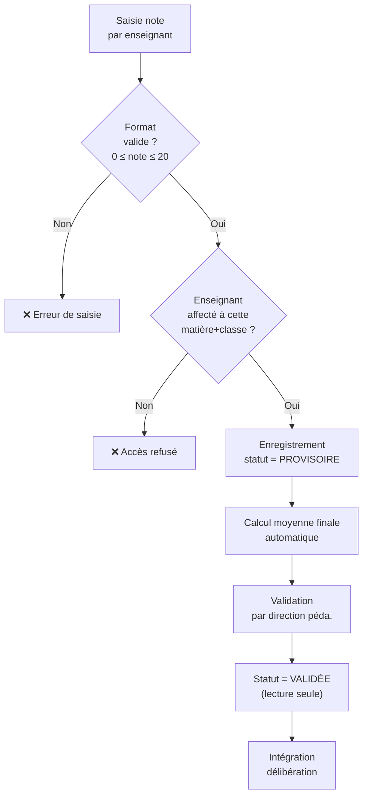

| ID | Règle | Priorité |
|---|---|---|
| `RG-NOT-001` | Une note doit être comprise entre **0 et 20 inclus**. Toute valeur hors de cet intervalle est rejetée. | 🔴 |
| `RG-NOT-002` | Une note est créée avec le statut `provisoire`. Elle passe à `validee` uniquement après validation explicite par la direction pédagogique. | 🔴 |
| `RG-NOT-003` | Chaque note est associée à une **session** : `1` (première session), `2` (deuxième session), `rattrapage`. Une note de session 2 ne peut exister que si une note de session 1 existe pour le même étudiant/matière/année. | 🔴 |
| `RG-NOT-004` | La **moyenne finale** est calculée automatiquement selon la formule définie pour l'année académique (ex. : `CC * 0.4 + Examen * 0.6`). Elle n'est pas saisie manuellement. | 🔴 |
| `RG-NOT-005` | La **moyenne générale** d'un étudiant est la moyenne pondérée par les coefficients des matières du semestre/année. | 🔴 |
| `RG-NOT-006` | Une note `validee` est en **lecture seule**. Toute correction doit passer par un workflow de **contestation**, validé par la direction pédagogique, avec motif obligatoire et tracé dans l'audit. | 🔴 |
| `RG-NOT-007` | Une note ne peut pas être saisie pour une **année académique clôturée**, sauf via le workflow de correction (avec validation admin). | 🔴 |
| `RG-NOT-008` | Si la note d'examen est **inférieure à un seuil éliminatoire** défini par l'établissement (ex. : < 5/20), l'étudiant est automatiquement ajourné, quelle que soit sa moyenne. | 🟠 |
| `RG-NOT-009` | Lors d'une **délibération**, le système recalcule toutes les moyennes générales et applique les règles de compensation définies par l'établissement (compensation inter-matières, inter-semestres). | 🔴 |
| `RG-NOT-010` | Les résultats possibles d'une délibération sont : `Admis`, `Ajourné`, `Admis par compensation`, `Exclu`. | 🔴 |
| `RG-NOT-011` | Un étudiant absent à un examen reçoit la note `0` avec mention `Absent (ABS)`. Cette note est distincte d'une note à `0`. | 🟠 |
| `RG-NOT-012` | Un étudiant peut **contester** une note provisoire. La contestation génère une demande soumise à l'enseignant concerné puis à la direction. | 🟡 |

---

## 📅 8. Emplois du Temps {#rg-edt}

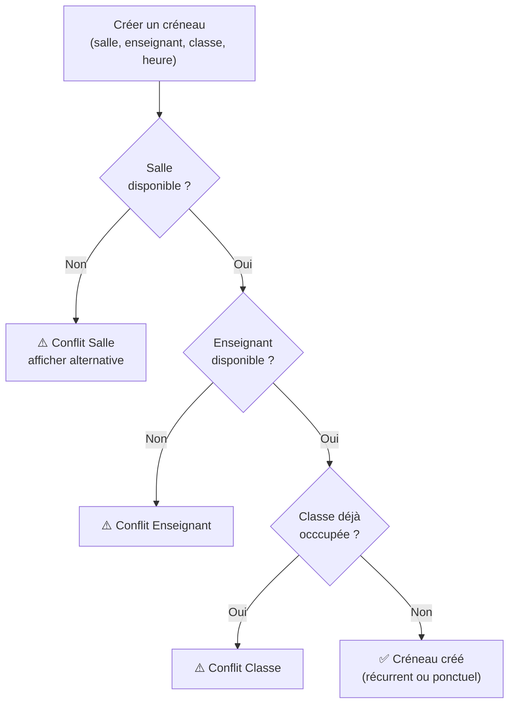

| ID | Règle | Priorité |
|---|---|---|
| `RG-EDT-001` | Un créneau horaire ne peut pas être créé si la **salle est déjà occupée** sur ce créneau. | 🔴 |
| `RG-EDT-002` | Un créneau horaire ne peut pas être créé si **l'enseignant est déjà planifié** sur ce créneau. | 🔴 |
| `RG-EDT-003` | Une classe ne peut pas avoir **deux cours simultanés**. | 🔴 |
| `RG-EDT-004` | En cas de conflit détecté, le système **bloque la création** et propose les créneaux libres disponibles pour la salle/l'enseignant. | 🟠 |
| `RG-EDT-005` | Un créneau peut être `récurrent` (se répète chaque semaine) ou `ponctuel`. | 🟠 |
| `RG-EDT-006` | La durée minimale d'un créneau est de **30 minutes**. La durée maximale est de **4 heures**. | 🟡 |
| `RG-EDT-007` | Les créneaux sont planifiés uniquement dans les **plages horaires définies** par l'établissement (ex. : 07h00–20h00). | 🟠 |
| `RG-EDT-008` | La capacité de la salle affectée doit être **supérieure ou égale au nombre d'étudiants** de la classe. | 🟠 |
| `RG-EDT-009` | La suppression d'un créneau récurrent propose de supprimer **uniquement l'occurrence** ou **toutes les occurrences futures**. | 🟡 |
| `RG-EDT-010` | Le volume horaire planifié pour une matière ne doit pas dépasser son **volume horaire défini** (CM + TD + TP). Le dépassement génère une alerte non bloquante. | 🟡 |

---

## 🏛️ 9. Salles {#rg-salle}

| ID | Règle | Priorité |
|---|---|---|
| `RG-SAL-001` | Chaque salle possède un **nom unique** par bâtiment et une capacité d'accueil obligatoire. | 🔴 |
| `RG-SAL-002` | Une salle peut avoir les types suivants : `cours`, `amphi`, `labo`, `soutenance`. Ces types filtrent les affectations (ex. : une soutenance ne peut être planifiée que dans une salle de type `cours` ou `soutenance`). | 🟠 |
| `RG-SAL-003` | Une salle peut être marquée comme **indisponible** (maintenance, travaux) pour une période donnée. Toute affectation existante sur cette période génère une alerte. | 🟠 |
| `RG-SAL-004` | La suppression physique d'une salle est **interdite** si elle possède des créneaux passés ou futurs. Elle passe en statut `désactivée`. | 🔴 |
| `RG-SAL-005` | La disponibilité d'une salle est vérifiée à la **minute près** pour éviter les chevauchements. | 🔴 |

---

## 📄 10. Documents Administratifs {#rg-document}

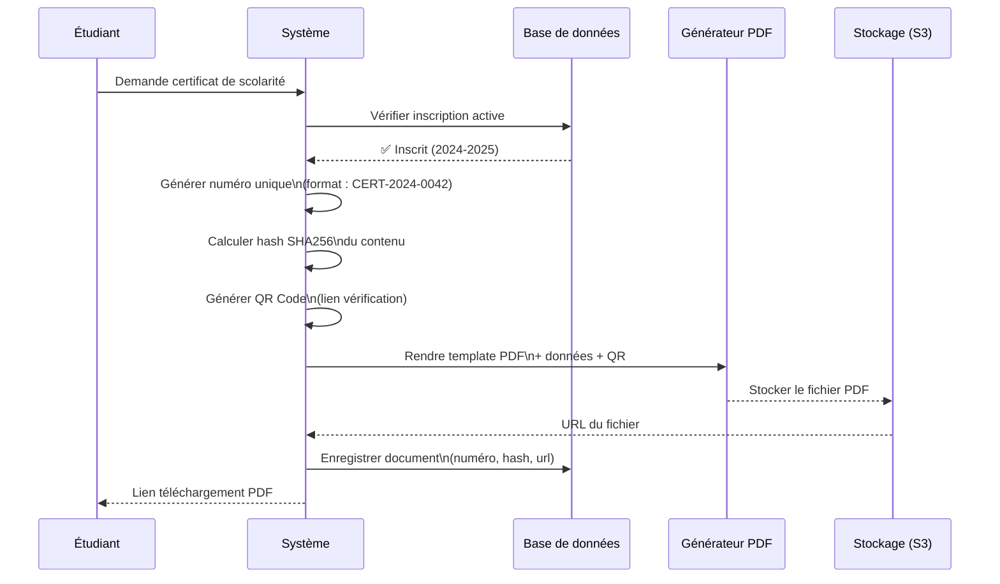

| ID | Règle | Priorité |
|---|---|---|
| `RG-DOC-001` | Chaque document généré reçoit un **numéro unique non recyclable** au format `[TYPE]-[ANNEE]-[SEQUENCE]` (ex. : `CERT-2024-0042`). | 🔴 |
| `RG-DOC-002` | Chaque document est associé à un **hash SHA256** de son contenu. Le QR Code intégré pointe vers un endpoint de vérification qui revalide ce hash. | 🔴 |
| `RG-DOC-003` | Un certificat de scolarité ne peut être généré que si l'étudiant possède une inscription au statut `inscrit` pour l'année académique courante. | 🔴 |
| `RG-DOC-004` | Un relevé de notes ne peut être généré que si les notes de l'année demandée sont au statut `validee`. | 🔴 |
| `RG-DOC-005` | Un document généré est **archivé numériquement** et ne peut pas être supprimé. | 🔴 |
| `RG-DOC-006` | Les **modèles de documents** (templates) sont personnalisables par établissement (logo, entête, pied de page). La modification d'un template ne modifie pas les documents déjà générés. | 🟠 |
| `RG-DOC-007` | Un document peut être régénéré uniquement par la `scolarite` ou l'`admin`, en cas d'erreur avérée. La nouvelle version est créée avec un nouveau numéro, l'ancienne est marquée `annulée`. | 🟠 |
| `RG-DOC-008` | Un étudiant en statut `suspendu` ne peut pas générer de documents administratifs. | 🟠 |
| `RG-DOC-009` | L'endpoint de vérification des documents est **public** (sans authentification) pour permettre à des tiers de vérifier l'authenticité d'un document. | 🔴 |

---

## 🎤 11. Soutenances {#rg-soutenance}

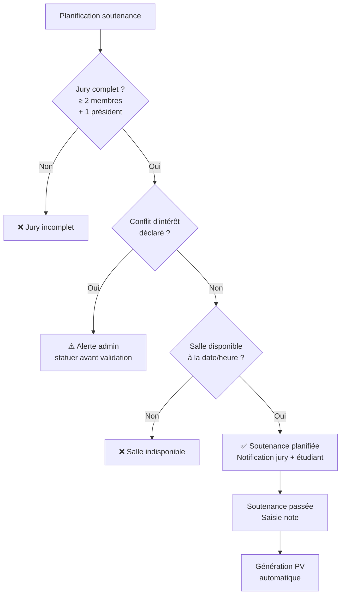

| ID | Règle | Priorité |
|---|---|---|
| `RG-SOU-001` | Un jury de soutenance doit comprendre **au minimum 2 membres**, dont obligatoirement **1 président**. | 🔴 |
| `RG-SOU-002` | Un enseignant ne peut pas être **à la fois président et rapporteur** d'une même soutenance. | 🔴 |
| `RG-SOU-003` | Tout lien familial entre un membre du jury et l'étudiant doit être **déclaré**. La soutenance ne peut être confirmée qu'après décision de la direction. | 🔴 |
| `RG-SOU-004` | La salle affectée à une soutenance doit être **disponible** sur le créneau horaire et de type `cours` ou `soutenance`. | 🔴 |
| `RG-SOU-005` | La note de soutenance est saisie par le **président du jury** uniquement, après la fin de la soutenance. | 🟠 |
| `RG-SOU-006` | Le **procès-verbal** est généré automatiquement après saisie de la note, avec le numéro de soutenance, les membres du jury, la note et la mention. | 🔴 |
| `RG-SOU-007` | Une soutenance `planifiée` peut être `reportée` avec un motif. La salle et le créneau sont alors libérés. | 🟠 |
| `RG-SOU-008` | Un étudiant ne peut passer sa soutenance que s'il est **inscrit et actif** pour l'année académique courante. | 🔴 |

---

## 🏠 12. Chambres du Campus {#rg-chambre}

| ID | Règle | Priorité |
|---|---|---|
| `RG-CHM-001` | Une chambre ne peut pas être occupée par **uniquement 2** . | 🔴 |
| `RG-CHM-002` | Un étudiant ne peut occuper **qu'une seule chambre à la fois**. | 🔴 |
| `RG-CHM-003` | Une occupation de chambre doit avoir une **date d'entrée** obligatoire. La date de sortie est définie à l'avance ou à la libération. | 🟠 |
| `RG-CHM-004` | Une chambre en statut `maintenance` ne peut pas faire l'objet d'une nouvelle affectation. | 🔴 |
| `RG-CHM-005` | L'historique des occupations d'une chambre est **conservé indéfiniment** pour traçabilité. | 🟠 |
| `RG-CHM-006` | Seuls les étudiants au statut `actif` peuvent se voir affecter une chambre. | 🟠 |

---

## 🔍 13. Traçabilité & Audit {#rg-audit}

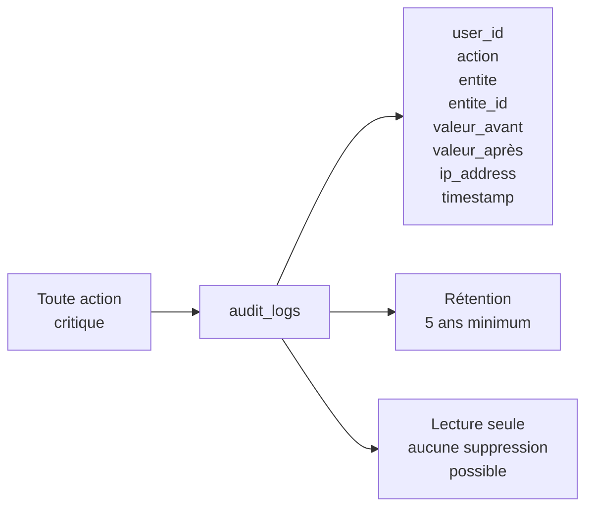

| ID | Règle | Priorité |
|---|---|---|
| `RG-TRA-001` | Toute **création, modification ou suppression** d'une entité critique (étudiant, note, inscription, document) est enregistrée dans `audit_logs` avec : userId, action, entité, valeur avant/après, IP, timestamp. | 🔴 |
| `RG-TRA-002` | Les entrées de l'audit sont en **lecture seule**. Elles ne peuvent jamais être modifiées ou supprimées. | 🔴 |
| `RG-TRA-003` | Les logs d'audit sont conservés **au minimum 5 ans**. | 🟠 |
| `RG-TRA-004` | Toute **correction de note validée** est tracée avec : note originale, note corrigée, auteur de la correction, motif, date. | 🔴 |
| `RG-TRA-005` | Toute **génération de document** est tracée avec : type, numéro, identité du demandeur, date. | 🔴 |
| `RG-TRA-006` | Les **connexions et déconnexions** des utilisateurs sont enregistrées avec IP et user-agent. | 🟠 |
| `RG-TRA-007` | L'`admin` peut consulter les logs d'audit via une interface dédiée, avec filtres par utilisateur, entité et période. | 🟡 |

---

## 📊 Récapitulatif des règles

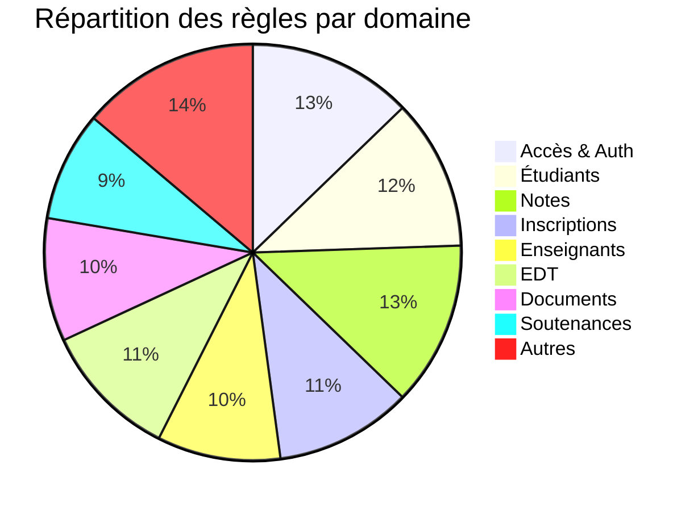

| Domaine | Total règles | 🔴 Bloquant | 🟠 Important | 🟡 Recommandé |
|---|---|---|---|---|
| Accès & Auth | 12 | 8 | 3 | 1 |
| Années Académiques | 7 | 5 | 1 | 1 |
| Filières & Classes | 8 | 3 | 4 | 1 |
| Étudiants | 11 | 6 | 4 | 1 |
| Inscriptions | 10 | 6 | 3 | 1 |
| Enseignants | 9 | 5 | 4 | 0 |
| Notes | 12 | 8 | 3 | 1 |
| Emplois du Temps | 10 | 4 | 4 | 2 |
| Salles | 5 | 3 | 2 | 0 |
| Documents | 9 | 6 | 3 | 0 |
| Soutenances | 8 | 5 | 3 | 0 |
| Chambres | 6 | 3 | 3 | 0 |
| Traçabilité | 7 | 5 | 2 | 0 |
| **TOTAL** | **119** | **67** | **39** | **8** |

---

> **💡 Conseil d'implémentation :** Commencer par implémenter les règles 🔴 Bloquantes dès le Sprint 1. Les règles 🟠 Importantes sont à couvrir au Sprint 2. Les règles 🟡 Recommandées peuvent être traitées en V2.
>
> Chaque règle `RG-XXX-NNN` doit être référencée dans le code source sous forme de commentaire pour assurer la traçabilité entre le document métier et l'implémentation.
