# 🗺️ Roadmap MVP — 2 Semaines

> **Objectif :** Livrer une plateforme universitaire fonctionnelle avec les modules core  
> **Stack :** React + Node.js/Express + PostgreSQL + Prisma  
> **Règle d'or :** Ne jamais passer à l'étape suivante si la précédente n'est pas stable ✅

---

## 📊 Vue d'ensemble

```mermaid
gantt
    title Roadmap MVP — 14 jours
    dateFormat  D
    axisFormat  Jour %d

    section 🏗️ Fondations
    Setup environnement           :done, 1, 1d
    Schéma BDD + Migrations       :done, 1, 2d
    Auth JWT + Rôles              :2, 2d

    section 👥 Gestion des personnes
    CRUD Étudiants                :4, 2d
    CRUD Enseignants              :5, 1d
    Filières + Classes            :5, 2d

    section 📝 Inscriptions & Finance
    Module Inscriptions           :7, 2d
    Bourses + Engagements         :8, 2d

    section 📊 Notes & Résultats
    Saisie des notes              :10, 2d
    Calcul moyennes               :11, 1d

    section 📄 Documents & Portails
    Génération PDF                :12, 2d
    Portail étudiant              :13, 1d
    Dashboard + Deploy            :14, 1d
```



---

## 📅 SEMAINE 1 — Les Fondations & le Cœur métier

---

### 🔵 JOUR 1 — Setup complet de l'environnement

> **Durée estimée :** 4–6h  
> **Objectif :** Avoir un projet qui tourne de A à Z, même vide

#### Matin — Infrastructure (2h)

- [ ] Créer le repo Git avec structure monorepo
  ```
  /
  ├── frontend/   (React + Vite)
  └── backend/    (Node.js + Express)
  ```
- [ ] Initialiser `docker-compose.yml` avec :
  - PostgreSQL 15
  - Redis 7
  - pgAdmin (interface visuelle BDD)
- [ ] Vérifier que `docker compose up` fonctionne sans erreur

#### Après-midi — Projet React (2h)

- [ ] `npm create vite@latest frontend -- --template react`
- [ ] Installer : `tailwindcss`, `shadcn/ui`, `react-router-dom`, `axios`, `@tanstack/react-query`, `zustand`
- [ ] Créer la structure de dossiers (`features/`, `components/`, `layouts/`, `lib/`)
- [ ] Page blanche qui compile sans erreur = ✅

#### Après-midi — Projet Backend (2h)

- [ ] `npm init` + installer : `express`, `prisma`, `@prisma/client`, `jsonwebtoken`, `bcrypt`, `zod`, `cors`, `dotenv`
- [ ] `npx prisma init` → connexion PostgreSQL dans `.env`
- [ ] Route `/health` qui répond `{ status: "ok" }` = ✅

---

### 🔵 JOUR 2 — Schéma de base de données

> **Durée estimée :** 5–7h  
> **Objectif :** Toutes les tables du MVP créées et migrées

#### Matin — Modèles Prisma Core (3h)

Créer dans `schema.prisma` dans cet ordre :

- [ ] `Universite` (multi-tenant)
- [ ] `AnneeAcademique`
- [ ] `Utilisateur` (auth)
- [ ] `Filiere`
- [ ] `Classe`
- [ ] `Etudiant`
- [ ] `Enseignant`

#### Après-midi — Modèles métier (3h)

- [ ] `Inscription` avec champs financiers (`statutFinancier`, `montantDu`, `soldRestant`)
- [ ] `Bourse`
- [ ] `EngagementPaiement`
- [ ] `Matiere`
- [ ] `Note`
- [ ] `Salle`
- [ ] `EmploiDuTemps`
- [ ] `DocumentGenere`

#### Fin de journée (1h)

- [ ] `npx prisma migrate dev --name init` → migration sans erreur
- [ ] `npx prisma studio` → vérifier visuellement toutes les tables
- [ ] Créer `seed.ts` avec données de test (1 université, 1 année académique, 3 rôles)

---

### 🔴 JOUR 3 — Authentification & Rôles

> **Durée estimée :** 5–6h  
> **Objectif :** Login fonctionnel avec protection des routes par rôle

#### Matin — Backend Auth (3h)

- [ ] `POST /api/auth/login` → vérifie email + password, retourne `accessToken` (15min) + `refreshToken` (7j)
- [ ] `POST /api/auth/refresh` → renouvelle le token
- [ ] `POST /api/auth/logout` → invalide le refresh token
- [ ] Middleware `authenticate` → vérifie JWT sur chaque route protégée
- [ ] Middleware `authorize(roles[])` → vérifie le rôle (`ADMIN`, `SCOLARITE`, `ENSEIGNANT`, `ETUDIANT`)

#### Après-midi — Frontend Auth (3h)

- [ ] Page `/login` avec formulaire email + password
- [ ] Store Zustand `authStore` : `{ user, token, login(), logout() }`
- [ ] `ProtectedRoute` component → redirige vers `/login` si pas de token
- [ ] Layout principal `AppLayout` avec :
  - Sidebar avec navigation selon le rôle
  - Header avec nom de l'utilisateur + bouton déconnexion
- [ ] Test : se connecter avec un compte admin → voir le dashboard vide = ✅

---

### 🟢 JOUR 4 — Gestion des Étudiants

> **Durée estimée :** 6–7h  
> **Objectif :** CRUD étudiant complet avec recherche et pagination

#### Matin — Backend Étudiants (3h)

- [ ] `GET /api/students` → liste paginée avec filtres (`?search=`, `?filiere=`, `?statut=`)
- [ ] `GET /api/students/:id` → détail complet
- [ ] `POST /api/students` → création avec validation Zod
- [ ] `PUT /api/students/:id` → mise à jour
- [ ] `DELETE /api/students/:id` → suppression logique (`is_active = false`)
- [ ] Auto-génération du matricule (`ETU-2024-XXXX`)

#### Après-midi — Frontend Étudiants (3h)

- [ ] `StudentList` : tableau avec colonnes (matricule, nom, filière, statut), recherche, pagination
- [ ] `StudentForm` : formulaire création/édition avec validation
- [ ] `StudentDetail` : fiche complète avec onglets (infos, inscriptions, notes)
- [ ] Badge coloré selon le statut (`ACTIF` vert, `SUSPENDU` rouge, `DIPLOME` bleu)

#### Fin de journée (1h)

- [ ] Tester : créer 5 étudiants fictifs depuis l'interface
- [ ] Vérifier pagination et recherche = ✅

---

### 🟢 JOUR 5 — Enseignants + Filières + Classes

> **Durée estimée :** 6h  
> **Objectif :** Toute la structure pédagogique en place

#### Matin — Enseignants (2h)

- [ ] `GET/POST/PUT/DELETE /api/teachers` avec différenciation `PERMANENT` / `VACATAIRE`
- [ ] Page liste enseignants + formulaire (similaire à étudiants)
- [ ] Champ `chargeHoraireMax` visible et éditable

#### Matin — Filières & Matières (2h)

- [ ] `GET/POST/PUT /api/filieres` + `GET/POST/PUT /api/matieres`
- [ ] Page de gestion des filières avec accordéon : filière → matières → coefficients
- [ ] Formulaire ajout de matière avec `coefficient`, `volumeHoraire`, `semestre`

#### Après-midi — Classes (2h)

- [ ] `GET/POST/PUT /api/classes` (liée à une filière + année académique)
- [ ] Page liste des classes avec filtre par filière et par année
- [ ] Afficher le nombre d'étudiants inscrits dans chaque classe (compteur live)

---

### 🟡 JOUR 6 — Module Inscriptions (partie 1)

> **Durée estimée :** 6–7h  
> **Objectif :** Workflow d'inscription de base fonctionnel

#### Matin — Backend Inscriptions (3h)

- [ ] `POST /api/inscriptions` → créer une inscription avec statut initial `EN_ATTENTE`
- [ ] `PATCH /api/inscriptions/:id/validate` → passer à `INSCRIT`
- [ ] `PATCH /api/inscriptions/:id/suspend` → passer à `SUSPENDU`
- [ ] Calcul automatique `soldeRestant = montantDu - montantPaye`
- [ ] `GET /api/inscriptions` avec filtres par statut financier

#### Après-midi — Frontend Inscriptions (3h)

- [ ] Page `InscriptionList` : tableau avec filtre par statut financier
- [ ] Formulaire `InscriptionForm` : sélection étudiant + classe + année
- [ ] Boutons d'action par ligne : `Valider`, `Suspendre`, `Enregistrer paiement`
- [ ] Badge statut financier coloré :
  - 🟢 `REGLE`
  - 🟠 `PROVISOIRE`
  - 🔴 `SUSPENDU`
  - 🔵 `BOURSIER_TOTAL`

---

### 🟡 JOUR 7 — Module Inscriptions (partie 2) — Bourses & Engagements

> **Durée estimée :** 6–7h  
> **Objectif :** Cas boursiers + reconnaissance de dette opérationnels

#### Matin — Bourses (3h)

- [ ] `POST /api/bourses` → créer une bourse liée à un étudiant
- [ ] Types : `BOURSE_ETAT`, `BOURSE_PARTIELLE`, `EXCELLENCE`, `EXONERATION`
- [ ] Logique : si bourse totale → `montantPaye = montantDu` → statut `BOURSIER_TOTAL` automatiquement
- [ ] Upload attestation de bourse (fichier PDF stocké dans MinIO)
- [ ] Interface : onglet "Bourse" dans la fiche étudiant

#### Après-midi — Engagement de paiement (3h)

- [ ] `POST /api/engagements` → créer un engagement avec `dateLimite` + `montantEngage`
- [ ] `PATCH /api/engagements/:id/report` → avenant (nouveau délai)
- [ ] Job automatique (cron) : chaque nuit, vérifier les engagements expirés → alerter
- [ ] Rappels automatiques : J-7 → envoyer email (ou log console pour le MVP)
- [ ] Interface : modal "Accorder un engagement" depuis la fiche inscription
- [ ] Afficher la **barre de progression** vers la date limite

#### Fin de journée (1h)

- [ ] Tester les 3 scénarios complets :
  1. Étudiant paye → `REGLE` ✅
  2. Étudiant boursier → `BOURSIER_TOTAL` ✅
  3. Étudiant avec engagement → `PROVISOIRE` → paiement → `REGLE` ✅

---

## 📅 SEMAINE 2 — Notes, Documents & Finitions

---

### 🟣 JOUR 8 — Saisie des notes

> **Durée estimée :** 6–7h  
> **Objectif :** Un enseignant peut saisir les notes de sa classe

#### Matin — Backend Notes (3h)

- [ ] `POST /api/grades/bulk` → saisie en masse (tableau étudiant + note)
- [ ] `GET /api/grades?classe=&matiere=&annee=` → récupérer les notes d'une classe
- [ ] `PUT /api/grades/:id` → corriger une note (loggé dans audit)
- [ ] Validation : note entre 0 et 20, coefficient > 0
- [ ] Interdire la saisie si `statutFinancier = SUSPENDU` (configurable)

#### Après-midi — Frontend Saisie (3h)

- [ ] Page `GradeEntry` : sélecteur classe + matière → tableau de saisie
- [ ] Tableau en ligne avec champs éditables : `note_cc`, `note_examen`
- [ ] Bouton "Enregistrer tout" → `POST /api/grades/bulk`
- [ ] Indicateur visuel : notes manquantes en orange, complètes en vert
- [ ] Verrou : une fois validées par la scolarité, notes non modifiables sans rôle ADMIN

---

### 🟣 JOUR 9 — Calcul des moyennes & délibération

> **Durée estimée :** 5–6h  
> **Objectif :** Calcul automatique avec affichage des résultats

#### Matin — Moteur de calcul (3h)

- [ ] Fonction `calculerMoyenneEtudiant(etudiantId, classeId, anneeId)` :
  ```
  moyenne = Σ(note_matiere × coefficient) / Σ(coefficients)
  ```
- [ ] Gérer les cas : note absente (`ABI`), note éliminatoire (< seuil configurable)
- [ ] `POST /api/deliberations` → déclencher le calcul pour toute une classe
- [ ] Statuts résultats : `ADMIS`, `AJOURNE`, `REDOUBLANT`, `EXCLU`
- [ ] `PATCH /api/deliberations/:id/publish` → rendre les résultats visibles aux étudiants

#### Après-midi — Interface résultats (3h)

- [ ] Page `Deliberation` : tableau classe avec moyenne + décision + boutons d'action
- [ ] Filtre : afficher uniquement les cas limites (entre 8 et 10)
- [ ] Bouton "Publier les résultats" → confirmation obligatoire (modal)
- [ ] Vue étudiant : ses notes par matière + sa moyenne générale + sa décision

---

### 🟤 JOUR 10 — Emploi du temps

> **Durée estimée :** 6h  
> **Objectif :** Créer des créneaux et détecter les conflits

#### Matin — Backend EDT (3h)

- [ ] `POST /api/schedule` → créer un créneau (classe + matière + enseignant + salle + jour + heures)
- [ ] Vérification automatique des conflits avant création :
  - Enseignant déjà occupé sur ce créneau ?
  - Salle déjà prise ?
  - Classe déjà en cours ?
- [ ] `GET /api/schedule?classe=` → emploi du temps d'une classe
- [ ] `GET /api/schedule?enseignant=` → emploi du temps d'un enseignant

#### Après-midi — Frontend EDT (3h)

- [ ] Vue grille hebdomadaire (lundi→vendredi, 7h→19h) avec les créneaux colorés par matière
- [ ] Clic sur un créneau → détail (enseignant, salle, matière)
- [ ] Bouton "Ajouter créneau" → formulaire avec détection de conflit en temps réel
- [ ] Message d'erreur clair si conflit : _"L'enseignant Dupont est déjà en cours de 10h à 12h"_

---

### 🟤 JOUR 11 — Gestion des salles + Affectations enseignants

> **Durée estimée :** 4h  
> **Objectif :** Inventaire des salles et affectations propres

#### Matin — Salles (2h)

- [ ] `GET/POST/PUT /api/rooms` → CRUD salle avec `capacite` et `type`
- [ ] Page liste des salles avec disponibilité du jour affiché
- [ ] Indicateur d'occupation : `3/5 créneaux occupés aujourd'hui`

#### Après-midi — Affectations enseignants (2h)

- [ ] `POST /api/assignments` → affecter un enseignant à une matière + classe
- [ ] Vérifier que les heures affectées ne dépassent pas `chargeHoraireMax`
- [ ] Page récapitulatif enseignant : ses matières + ses classes + ses heures (barre de progression)

---

### 🟠 JOUR 12 — Génération de documents PDF

> **Durée estimée :** 7h  
> **C'est la partie la plus chronophage — gardez toute la journée**

#### Matin — Templates PDF (3h)

Avec `PDFKit`, créer 3 templates :

- [ ] **Certificat de scolarité** :
  - En-tête université (logo, nom, adresse)
  - Corps : nom étudiant, matricule, filière, année, statut
  - Numéro de référence auto (`CERT-2024-XXXX`)
  - Pied de page : signature + cachet

- [ ] **Relevé de notes** :
  - Tableau : matière | coefficient | note CC | note examen | moyenne
  - Ligne totale : moyenne générale + décision

- [ ] **Document d'engagement de paiement** :
  - Montant dû, date limite, conséquences
  - Champ signature (ligne à signer physiquement)

#### Après-midi — API + Stockage (2h)

- [ ] `POST /api/documents/generate` → `{ type, etudiantId }`
- [ ] Upload vers MinIO → retourner URL sécurisée
- [ ] Enregistrer dans `DocumentGenere` avec numéro de référence unique
- [ ] `GET /api/documents/:id` → télécharger le PDF

#### Fin d'après-midi — Frontend (2h)

- [ ] Bouton "Générer" dans la fiche étudiant → spinner → lien de téléchargement
- [ ] Liste des documents générés avec date + type + bouton re-téléchargement
- [ ] Bloquer la génération si `statutFinancier = SUSPENDU` ou `PROVISOIRE`

---

### 🟠 JOUR 13 — Portail étudiant + Dashboard admin

> **Durée estimée :** 5h

#### Matin — Portail étudiant (3h)

L'étudiant connecté voit **en lecture seule** :

- [ ] **Mes notes** : tableau par matière, moyenne, décision
- [ ] **Mon emploi du temps** : vue semaine
- [ ] **Mes documents** : liste + téléchargement (bloqué si provisoire)
- [ ] **Mon statut financier** : badge + solde restant + date limite si engagement
- [ ] **Mes demandes** : formulaire de demande de certificat (workflow simple)

#### Après-midi — Dashboard Admin (2h)

- [ ] Indicateurs clés en haut :
  - Total étudiants inscrits
  - Étudiants en situation financière critique (`PROVISOIRE` + `SUSPENDU`)
  - Taux de paiement (%)
  - Nombre de documents générés ce mois

- [ ] Graphiques avec Recharts :
  - Répartition par filière (camembert)
  - Inscriptions par statut financier (barres)

- [ ] Tableau d'alertes :
  - 🔴 Engagements dépassés (action requise)
  - 🟠 Engagements expirant dans 7 jours
  - 🟡 Notes non encore saisies pour des classes en cours

---

### ✅ JOUR 14 — Tests, corrections & déploiement

> **Durée estimée :** 6–8h  
> **Objectif :** Livrer quelque chose de stable

#### Matin — Tests de bout en bout (3h)

Tester les **3 scénarios utilisateurs complets** :

- [ ] **Scénario 1 — Étudiant boursier**
  1. Créer étudiant → inscrire en L2 Info → attacher une bourse d'État → vérifier statut `BOURSIER_TOTAL` → générer certificat de scolarité

- [ ] **Scénario 2 — Étudiant avec engagement**
  1. Créer étudiant → inscrire → accorder engagement 30 jours → vérifier droits limités → enregistrer paiement → vérifier passage à `REGLE` → générer relevé

- [ ] **Scénario 3 — Cycle académique complet**
  1. Créer classe → affecter enseignant → saisir notes → déclencher délibération → publier résultats → étudiant consulte depuis son portail

#### Après-midi — Corrections & déploiement (3h)

- [ ] Fixer les bugs remontés le matin
- [ ] Variables d'environnement propres (`.env.production`)
- [ ] `docker build` frontend + backend sans erreur
- [ ] Déployer sur VPS (DigitalOcean / Hetzner) ou Railway.app
- [ ] HTTPS avec certificat SSL (Let's Encrypt / Nginx)
- [ ] Test final depuis un navigateur externe = ✅

---

## 📋 Récapitulatif par priorité

```mermaid
graph LR
    subgraph P1["🔴 Bloquant — Jours 1-3"]
        A["Setup Docker"]
        B["Schéma BDD"]
        C["Auth + Rôles"]
    end

    subgraph P2["🟠 Core — Jours 4-7"]
        D["CRUD Étudiants"]
        E["CRUD Enseignants"]
        F["Filières + Classes"]
        G["Inscriptions\n+ Bourses\n+ Engagements"]
    end

    subgraph P3["🟡 Métier — Jours 8-11"]
        H["Saisie Notes"]
        I["Calcul Moyennes"]
        J["Emploi du temps"]
        K["Salles + Affectations"]
    end

    subgraph P4["🟢 Livraison — Jours 12-14"]
        L["Génération PDF"]
        M["Portail Étudiant"]
        N["Dashboard"]
        O["Deploy"]
    end

    P1 --> P2 --> P3 --> P4

    style P1 fill:#DC2626,color:#fff,stroke:#B91C1C
    style P2 fill:#D97706,color:#fff,stroke:#B45309
    style P3 fill:#D97706,color:#fff,stroke:#CA8A04
    style P4 fill:#059669,color:#fff,stroke:#047857
```



---

## ⚠️ Règles à respecter pendant le développement

| Règle | Pourquoi |
|-------|----------|
| Committer chaque soir, même incomplet | Éviter de tout perdre |
| Tester un endpoint avant de passer au suivant | Détecter les bugs tôt |
| Ne jamais sauter les migrations Prisma | Incohérence BDD fatale |
| `created_at` + `updated_at` sur chaque table | Impossible à ajouter proprement après |
| Toujours valider avec Zod côté API | Le frontend peut mentir |
| Ne pas styliser avant que ça fonctionne | Perte de temps garantie |
| La génération PDF au Jour 12 max | C'est plus long que prévu, toujours |

---

## 🚀 Ce qui est exclu du MVP (Phase 2)

Ces fonctionnalités sont documentées mais **ne doivent pas vous distraire pendant ces 2 semaines** :

- Paiement en ligne
- Gestion des chambres du campus
- Module soutenances complet
- Signature électronique des documents
- Application mobile
- Notifications SMS (remplacées par logs console dans le MVP)
- Rapport d'audit complet
- API publique / intégrations tierces
