# 🎓 UniPlatform — Conception Complète
> **Plateforme de Gestion Universitaire Unifiée**  
> Stack : React · Node.js · PostgreSQL · MVP 2 semaines

---

## 📋 Table des matières

1. [Vision & Périmètre](#vision)
2. [Zones d'ombre & Cas non imaginés](#zones-ombre)
3. [Architecture Globale](#architecture)
4. [Modèle de Données UML](#uml)
5. [Diagramme de Classes OO](#classes)
6. [User Stories & Backlog Scrum](#scrum)
7. [Architecture Frontend (React)](#frontend)
8. [Architecture Backend (Node.js)](#backend)
9. [Schéma Base de Données](#database)
10. [Roadmap MVP 2 semaines](#roadmap)
11. [Stack Technologique](#stack)
12. [Considérations Sécurité](#securite)
13. [Récapitulatif](#recapitulatif)

---

## 🎯 1. Vision & Périmètre {#vision}

> Centraliser 100% des opérations académiques dans une seule plateforme, accessible par rôle, depuis n'importe quel appareil.

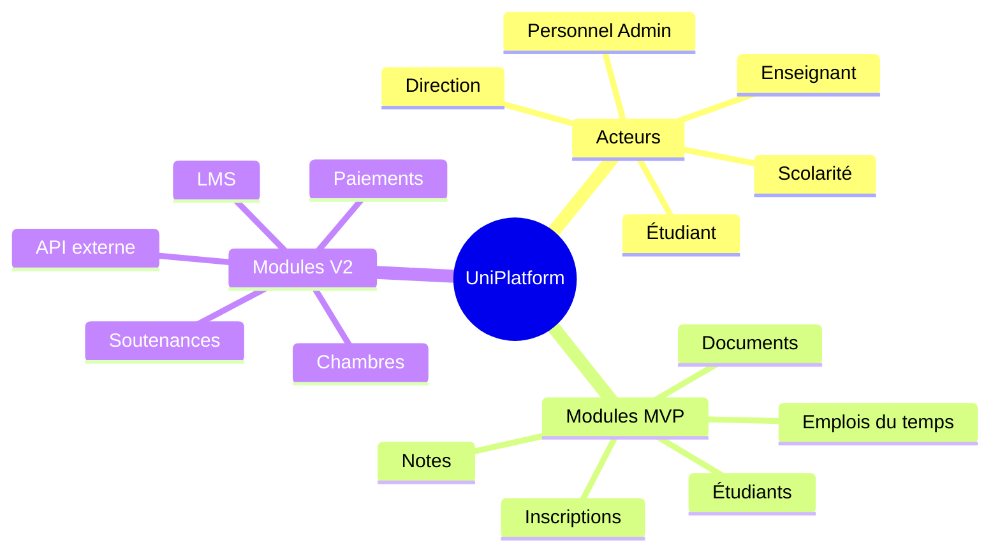

---

## ⚠️ 2. Zones d'ombre — Cas non imaginés {#zones-ombre}

> Ces situations **critiques** n'apparaissent pas dans la conception initiale et doivent être traitées en amont.

### 2.1 Situations académiques complexes

| Situation | Problème si non géré | Solution à prévoir |
| --- | --- | --- |
| **Étudiant doublement inscrit** | Deux filières en parallèle (ex : droit + licence pro) | Autorisation explicite par admin + flag multi-inscription |
| **Changement de filière en cours d'année** | Historique cassé, notes perdues | Table `transfert_filiere` avec date et motif |
| **Équivalences de cours étrangers** | Notes d'échanges Erasmus/étrangers | Module validation d'acquis avec correspondance matières |
| **Rattrapage & sessions spéciales** | Notes de 1ère et 2ème session distinctes | `session` (1, 2, rattrapage) sur chaque note |
| **Étudiant décédé ou disparu** | Statut bloqué, historique requis | Statut `archivé_décès`, données conservées 10 ans |
| **Étudiant en congé médical** | Ni présent, ni abandonné | Statut `congé_médical` avec dates de reprise |
| **Reconnaissance de diplôme étranger** | Niveau d'entrée ambigu | Champ `diplome_etranger_validé` + attachement scan |

### 2.2 Situations d'enseignement

| Situation | Problème | Solution |
|---|---|---|
| **Cours mutualisés** | Une matière partagée entre 2 filières | Relation M:N `cours ↔ classe` |
| **Enseignant en arrêt maladie** | Cours non assuré, remplacement urgent | Statut `remplacement_temporaire` + notification auto |
| **Vacataire sans contrat signé** | Peut saisir des notes sans être formalisé | Validation de contrat avant activation compte |
| **Conflit d'intérêt jury** | Enseignant qui note son propre proche | Flag `lien_familial` à déclarer à la création du jury |
| **Saisie de notes après deadline** | Délibération passée | Workflow de correction avec validation doyen |
| **Matière enseignée par 2 enseignants** | Qui saisit quoi ? | Partition de la matière (CM/TD/TP) par sous-groupe |

### 2.3 Situations administratives

| Situation | Problème | Solution |
|---|---|---|
| **Doublon d'étudiant** | Même étudiant créé deux fois | Détection par (nom + prénom + date naissance + ville) |
| **Numéro étudiant recyclé** | Ancien numéro réattribué à un nouveau | UUID permanent + code lisible non recyclable |
| **Document falsifié** | Certificat modifié après génération | QR Code de vérification + hash SHA256 du contenu |
| **Changement de règle de calcul en cours d'année** | Quelle formule s'applique ? | Versioning des règles pédagogiques par `annee_academique` |
| **Année académique non clôturée** | On ne peut pas passer à la suivante | Workflow de clôture avec checklist obligatoire |
| **Données RGPD** | Droit à l'oubli d'un étudiant sorti | Politique de rétention + anonymisation après 10 ans |

### 2.4 Situations infrastructurelles

| Situation | Problème | Solution |
|---|---|---|
| **Panne pendant délibération** | Données partiellement sauvées | Transactions DB atomiques + autosave toutes les 30s |
| **Plusieurs admins simultanés** | Conflits de modification | Optimistic locking + notifications de conflit |
| **Import de données depuis Excel** | Migration depuis l'ancien système | Module d'import CSV/Excel avec validation et rapport d'erreurs |
| **Connexion lente / offline** | Zone à faible couverture | PWA avec cache offline pour consultation des notes |

---

## 🏗️ 3. Architecture Globale {#architecture}

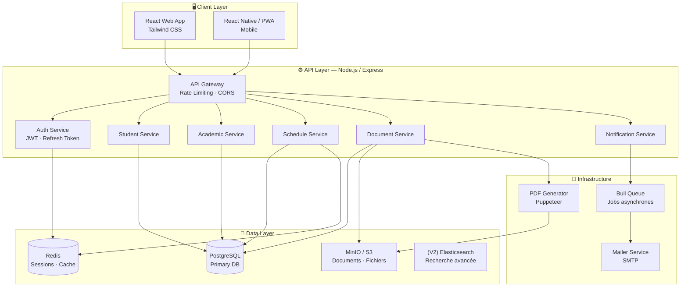

---

## 📐 4. Modèle de Données UML — Entités Principales {#uml}

```mermaid
erDiagram
    ANNEE_ACADEMIQUE {
        uuid id PK
        string code "2024-2025"
        date date_debut
        date date_fin
        enum statut "ouvert|clos|archivé"
        boolean est_courante
    }

    UNIVERSITE {
        uuid id PK
        string nom
        string code
        string logo_url
        jsonb parametres
    }

    FILIERE {
        uuid id PK
        uuid universite_id FK
        string nom
        string code
        enum niveau "licence|master|doctorat|bts"
        int duree_annees
    }

    CLASSE {
        uuid id PK
        uuid filiere_id FK
        uuid annee_academique_id FK
        string nom
        int capacite_max
        int annee_niveau "1,2,3..."
    }

    ETUDIANT {
        uuid id PK
        string numero_etudiant UK
        string nom
        string prenom
        date date_naissance
        string email UK
        string telephone
        enum statut "actif|suspendu|diplome|abandon|conge_medical|archive"
        boolean multi_inscription
        timestamp created_at
    }

    INSCRIPTION {
        uuid id PK
        uuid etudiant_id FK
        uuid classe_id FK
        uuid annee_academique_id FK
        enum statut "inscrit|en_attente|rejete|suspendu"
        date date_inscription
        int session_inscription "1|2"
        string motif_rejet
        boolean est_transfert
        uuid classe_precedente_id FK
    }

    ENSEIGNANT {
        uuid id PK
        string matricule UK
        string nom
        string prenom
        string email UK
        enum type "permanent|vacataire"
        string specialite
        int quota_heures_max
        enum statut "actif|conge|inactif"
    }

    MATIERE {
        uuid id PK
        uuid filiere_id FK
        string nom
        string code UK
        float coefficient
        int volume_horaire_cm
        int volume_horaire_td
        int volume_horaire_tp
        int annee_niveau
        int semestre "1|2"
    }

    AFFECTATION_ENSEIGNANT {
        uuid id PK
        uuid enseignant_id FK
        uuid matiere_id FK
        uuid classe_id FK
        uuid annee_academique_id FK
        enum type_seance "CM|TD|TP"
        int heures_effectuees
    }

    NOTE {
        uuid id PK
        uuid etudiant_id FK
        uuid matiere_id FK
        uuid annee_academique_id FK
        uuid saisi_par FK
        float note_cc
        float note_exam
        float moyenne_finale
        int session "1|2|rattrapage"
        enum statut "provisoire|validee|contestee"
        timestamp saisi_le
        timestamp validee_le
        string commentaire
    }

    SALLE {
        uuid id PK
        uuid universite_id FK
        string nom
        string batiment
        int capacite
        enum type "cours|amphi|labo|soutenance"
        boolean disponible
    }

    CRENEAU_HORAIRE {
        uuid id PK
        uuid salle_id FK
        uuid affectation_id FK
        uuid annee_academique_id FK
        date date
        time heure_debut
        time heure_fin
        enum jour "lun|mar|mer|jeu|ven|sam"
        boolean est_recurrent
    }

    SOUTENANCE {
        uuid id PK
        uuid etudiant_id FK
        uuid salle_id FK
        uuid annee_academique_id FK
        string titre_memoire
        datetime date_heure
        float note
        enum statut "planifiee|terminee|reportee"
        string pv_url
    }

    JURY_SOUTENANCE {
        uuid id PK
        uuid soutenance_id FK
        uuid enseignant_id FK
        enum role "president|rapporteur|membre"
        boolean conflit_interet
    }

    DOCUMENT_ADMINISTRATIF {
        uuid id PK
        uuid etudiant_id FK
        uuid genere_par FK
        enum type "certificat|releve|attestation|decision"
        string numero_unique UK
        string hash_sha256
        string qr_code_url
        string fichier_url
        timestamp genere_le
        boolean archive
    }

    UTILISATEUR {
        uuid id PK
        string email UK
        string password_hash
        enum role "admin|scolarite|enseignant|etudiant|personnel"
        uuid profil_id
        string profil_type
        boolean actif
        timestamp derniere_connexion
    }

    CHAMBRE_CAMPUS {
        uuid id PK
        uuid universite_id FK
        string numero
        string batiment
        int capacite
        enum type "simple|double|studio"
        enum statut "disponible|occupee|maintenance"
    }

    OCCUPATION_CHAMBRE {
        uuid id PK
        uuid chambre_id FK
        uuid etudiant_id FK
        date date_entree
        date date_sortie
        enum statut "active|terminee|annulee"
    }

    ANNEE_ACADEMIQUE ||--o{ CLASSE : "contient"
    ANNEE_ACADEMIQUE ||--o{ INSCRIPTION : "regroupe"
    ANNEE_ACADEMIQUE ||--o{ NOTE : "concerne"
    FILIERE ||--o{ CLASSE : "contient"
    FILIERE ||--o{ MATIERE : "définit"
    UNIVERSITE ||--o{ FILIERE : "propose"
    UNIVERSITE ||--o{ SALLE : "possède"
    UNIVERSITE ||--o{ CHAMBRE_CAMPUS : "héberge"
    ETUDIANT ||--o{ INSCRIPTION : "a"
    ETUDIANT ||--o{ NOTE : "reçoit"
    ETUDIANT ||--o{ SOUTENANCE : "passe"
    ETUDIANT ||--o{ DOCUMENT_ADMINISTRATIF : "obtient"
    CLASSE ||--o{ INSCRIPTION : "accueille"
    CLASSE ||--o{ AFFECTATION_ENSEIGNANT : "liée à"
    ENSEIGNANT ||--o{ AFFECTATION_ENSEIGNANT : "assure"
    ENSEIGNANT ||--o{ JURY_SOUTENANCE : "participe"
    ENSEIGNANT ||--o{ NOTE : "saisit"
    MATIERE ||--o{ AFFECTATION_ENSEIGNANT : "concernée par"
    MATIERE ||--o{ NOTE : "évaluée par"
    AFFECTATION_ENSEIGNANT ||--o{ CRENEAU_HORAIRE : "planifié dans"
    SALLE ||--o{ CRENEAU_HORAIRE : "utilisée dans"
    SALLE ||--o{ SOUTENANCE : "accueille"
    SOUTENANCE ||--o{ JURY_SOUTENANCE : "composé de"
    CHAMBRE_CAMPUS ||--o{ OCCUPATION_CHAMBRE : "a"
    ETUDIANT ||--o{ OCCUPATION_CHAMBRE : "occupe"
```

---

## 🧱 5. Diagramme de Classes — Orienté Objet {#classes}

```mermaid
classDiagram
    class Etudiant {
        +UUID id
        +String numeroEtudiant
        +String nom
        +String prenom
        +Date dateNaissance
        +String email
        +StatutEtudiant statut
        +Boolean multiInscription
        +inscrire(classe, annee) Inscription
        +obtenirNotes(annee) Note[]
        +genererDocument(type) Document
        +calculerMoyenne(annee) Float
    }

    class Inscription {
        +UUID id
        +StatutInscription statut
        +Date dateInscription
        +Int sessionInscription
        +Boolean estTransfert
        +valider() void
        +rejeter(motif) void
        +suspendre() void
    }

    class Classe {
        +UUID id
        +String nom
        +Int capaciteMax
        +Int anneeNiveau
        +getEtudiants() Etudiant[]
        +getEnseignants() Enseignant[]
        +getEmploiDuTemps() Creneau[]
        +getNombreInscrits() Int
        +estComplete() Boolean
    }

    class Enseignant {
        +UUID id
        +String matricule
        +TypeEnseignant type
        +Int quotaHeuresMax
        +StatutEnseignant statut
        +getChargeHoraire(annee) Int
        +getClasses(annee) Classe[]
        +saisirNote(etudiant, matiere, note) Note
        +estDisponible(creneau) Boolean
    }

    class Matiere {
        +UUID id
        +String code
        +String nom
        +Float coefficient
        +Int volumeHoraireCM
        +Int volumeHoraireTD
        +Int volumeHoraireTP
        +Int semestre
        +calculerMoyenneClasse(classe) Float
    }

    class Note {
        +UUID id
        +Float noteCC
        +Float noteExam
        +Float moyenneFinale
        +Int session
        +StatutNote statut
        +valider() void
        +contester(motif) void
        +calculerMoyenne() Float
        +estEliminatoire() Boolean
    }

    class Soutenance {
        +UUID id
        +String titreMemoire
        +DateTime dateHeure
        +Float note
        +StatutSoutenance statut
        +ajouterJure(enseignant, role) void
        +genererPV() Document
        +verifierConflitInteret() Boolean
    }

    class Salle {
        +UUID id
        +String nom
        +Int capacite
        +TypeSalle type
        +estDisponible(debut, fin) Boolean
        +getCreneaux(semaine) Creneau[]
    }

    class DocumentAdministratif {
        +UUID id
        +TypeDocument type
        +String numeroUnique
        +String hashSha256
        +String qrCodeUrl
        +generer() void
        +verifier(hash) Boolean
        +archiver() void
    }

    class AnneeAcademique {
        +UUID id
        +String code
        +Date dateDebut
        +Date dateFin
        +StatutAnnee statut
        +Boolean estCourante
        +ouvrir() void
        +cloturer() void
        +archiver() void
        +getStatistiques() Stats
    }

    class Utilisateur {
        +UUID id
        +String email
        +Role role
        +Boolean actif
        +seConnecter(email, mdp) Token
        +seDeconnecter() void
        +changerMotDePasse(ancien, nouveau) void
    }

    class ServiceNote {
        <<service>>
        +calculerMoyenneGenerale(etudiant, annee) Float
        +genererReleve(etudiant, annee) Document
        +deliberer(classe, annee) Resultat[]
        +verifierCoherence(notes) Erreur[]
    }

    class ServiceEmploiDuTemps {
        <<service>>
        +creerCreneau(affectation, salle, debut, fin) Creneau
        +detecterConflits(creneau) Conflit[]
        +suggererSalle(cours, nbEtudiants) Salle[]
        +exporterEmploiDuTemps(classe) PDF
    }

    class ServiceDocument {
        <<service>>
        +genererCertificatScolarite(etudiant) Document
        +genererReleve(etudiant, annee) Document
        +verifierDocument(qrCode) Boolean
        +archiverBatch(annee) void
    }

    Etudiant "1" --> "0..*" Inscription : passe
    Classe "1" --> "0..*" Inscription : accueille
    Etudiant "1" --> "0..*" Note : reçoit
    Matiere "1" --> "0..*" Note : évaluée
    Enseignant "1" --> "0..*" Note : saisit
    Enseignant "1" --> "0..*" Soutenance : juge
    Etudiant "1" --> "0..*" Soutenance : passe
    Salle "1" --> "0..*" Soutenance : accueille
    Etudiant "1" --> "0..*" DocumentAdministratif : obtient
    Classe "0..*" --> "1" AnneeAcademique : appartient
    ServiceNote ..> Note : gère
    ServiceNote ..> Etudiant : concerne
    ServiceEmploiDuTemps ..> Salle : consulte
    ServiceEmploiDuTemps ..> Enseignant : planifie
    ServiceDocument ..> DocumentAdministratif : génère
    Utilisateur --> Etudiant : profil
    Utilisateur --> Enseignant : profil
```

---

## 📌 6. Backlog Scrum — User Stories {#scrum}

### Épics & Sprints MVP (2 semaines)

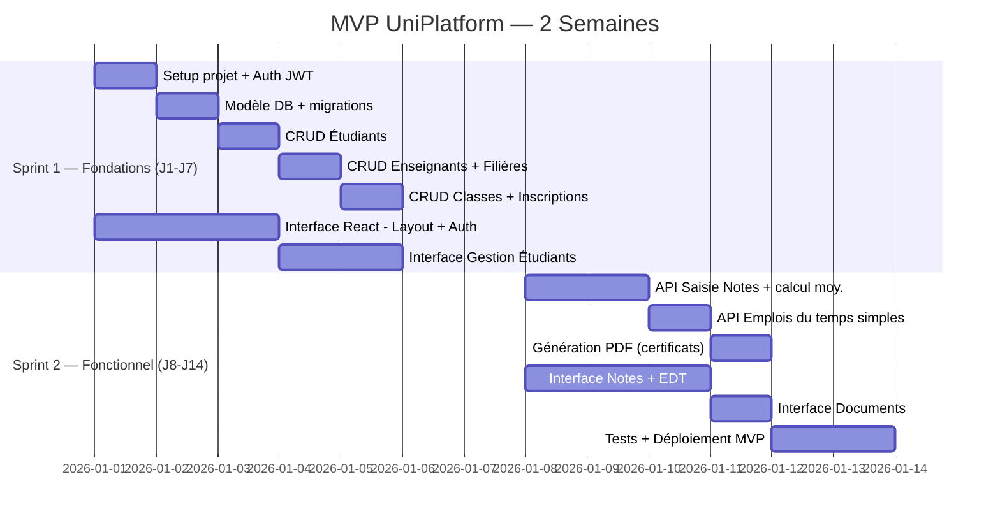

### Backlog priorisé


### User Stories principales

#### 🔐 Authentification
```
US-001 : En tant qu'administrateur,
         je veux me connecter avec email/mot de passe
         afin d'accéder aux fonctionnalités de gestion.
         → Critères : JWT, refresh token, rôle vérifié, logout.

US-002 : En tant qu'étudiant,
         je veux réinitialiser mon mot de passe par email
         afin de ne pas être bloqué hors de mon compte.
```

#### 🎓 Gestion étudiants
```
US-010 : En tant que scolarité,
         je veux créer un dossier étudiant complet
         afin d'enregistrer un nouvel étudiant.
         → Critères : doublon détecté, numéro auto-généré, email unique.

US-011 : En tant que scolarité,
         je veux changer le statut d'un étudiant (congé médical, abandon)
         afin de refléter sa situation réelle.
         → Critères : historique du statut conservé, motif obligatoire.

US-012 : En tant qu'étudiant,
         je veux consulter mes informations personnelles
         afin de vérifier et corriger mes données.
```

#### 📝 Inscriptions
```
US-020 : En tant que scolarité,
         je veux inscrire un étudiant à une classe
         afin de formaliser son parcours pour l'année.
         → Critères : vérifier quota classe, détecter double inscription.

US-021 : En tant qu'étudiant,
         je veux faire une préinscription en ligne
         afin d'initier ma demande d'inscription.
```

#### 📊 Notes
```
US-030 : En tant qu'enseignant,
         je veux saisir les notes de mes étudiants par matière
         afin de les enregistrer dans le système.
         → Critères : validation 0-20, session 1/2/rattrapage, provisoire avant validation.

US-031 : En tant que directeur pédagogique,
         je veux valider les notes avant délibération
         afin d'en garantir la fiabilité.

US-032 : En tant qu'étudiant,
         je veux consulter mes notes
         afin de suivre ma progression académique.
```

#### 📄 Documents
```
US-040 : En tant qu'étudiant,
         je veux télécharger mon certificat de scolarité
         afin de le soumettre à des organismes externes.
         → Critères : QR code de vérification, numéro unique, PDF signé.

US-041 : En tant que scolarité,
         je veux générer des relevés de notes officiels
         afin de les remettre aux étudiants.
```

---

## ⚛️ 7. Architecture Frontend React {#frontend}

### Structure des dossiers

```
src/
├── app/                    # Config globale (router, store, theme)
│   ├── router.tsx
│   ├── store.ts           # Zustand global state
│   └── theme.ts
├── features/               # Modules métier (feature-based)
│   ├── auth/
│   │   ├── components/    # LoginForm, ResetPassword
│   │   ├── hooks/         # useAuth, useSession
│   │   ├── pages/         # LoginPage
│   │   └── api.ts         # authApi
│   ├── students/
│   │   ├── components/    # StudentCard, StudentForm, StudentTable
│   │   ├── hooks/         # useStudents, useStudentDetail
│   │   ├── pages/         # StudentsPage, StudentDetailPage
│   │   └── api.ts
│   ├── grades/
│   ├── schedule/
│   ├── documents/
│   ├── enrollments/
│   └── dashboard/
├── shared/                 # Composants réutilisables
│   ├── components/         # Button, Modal, DataTable, Badge
│   ├── hooks/             # useDebounce, usePagination
│   ├── utils/             # formatDate, formatNote, generatePDF
│   └── types/             # TypeScript interfaces globales
└── api/                    # Axios instance + interceptors
    ├── client.ts
    └── endpoints.ts
```

### Flux de navigation par rôle

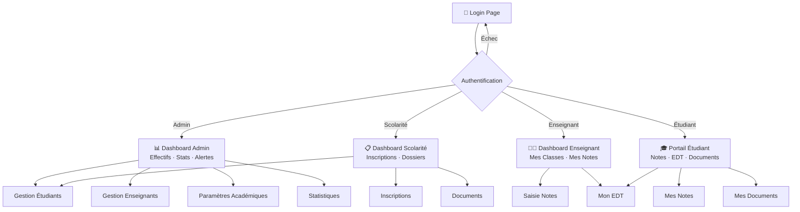

### Composants clés

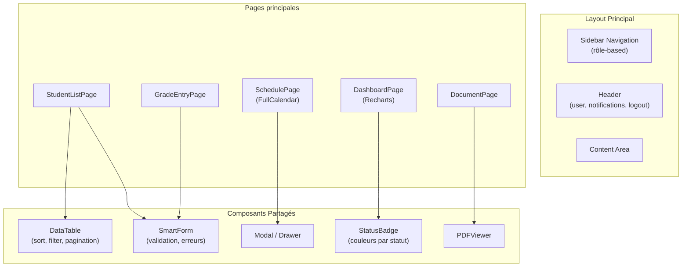

---

## 🖥️ 8. Architecture Backend Node.js {#backend}

### Structure API REST

```
api/
├── src/
│   ├── modules/
│   │   ├── auth/
│   │   │   ├── auth.controller.ts
│   │   │   ├── auth.service.ts
│   │   │   ├── auth.middleware.ts   # JWT verify
│   │   │   └── auth.routes.ts
│   │   ├── students/
│   │   ├── teachers/
│   │   ├── enrollments/
│   │   ├── grades/
│   │   ├── schedule/
│   │   ├── documents/
│   │   └── dashboard/
│   ├── shared/
│   │   ├── middleware/
│   │   │   ├── roleGuard.ts        # RBAC
│   │   │   ├── rateLimiter.ts
│   │   │   ├── validator.ts        # Zod schemas
│   │   │   └── auditLog.ts         # Traçabilité
│   │   ├── database/
│   │   │   ├── db.ts               # Knex / Prisma client
│   │   │   └── migrations/
│   │   └── utils/
│   │       ├── pdfGenerator.ts     # Puppeteer
│   │       ├── qrCode.ts
│   │       └── hashUtils.ts
│   └── app.ts
```

### Flux API — Saisie de Note (exemple complet)

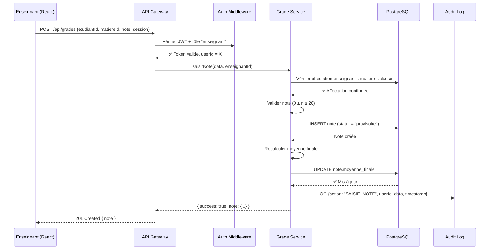

### Endpoints API principaux

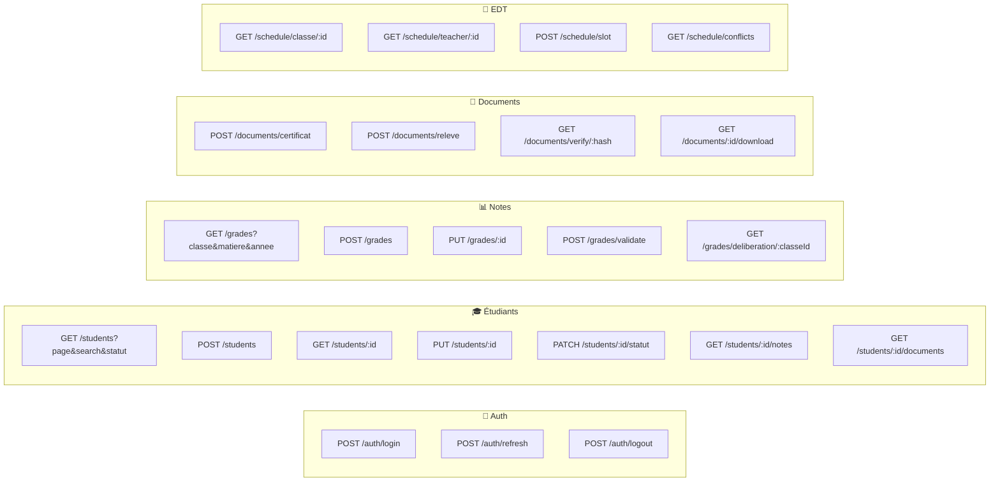

### Middleware RBAC — Contrôle d'accès

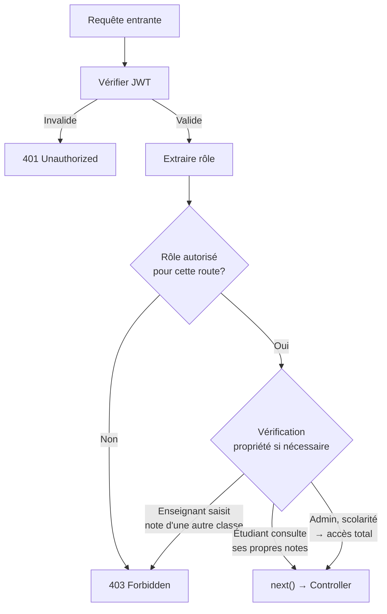

---

## 🗄️ 9. Schéma Base de Données PostgreSQL {#database}

### Schéma physique simplifié (tables MVP)

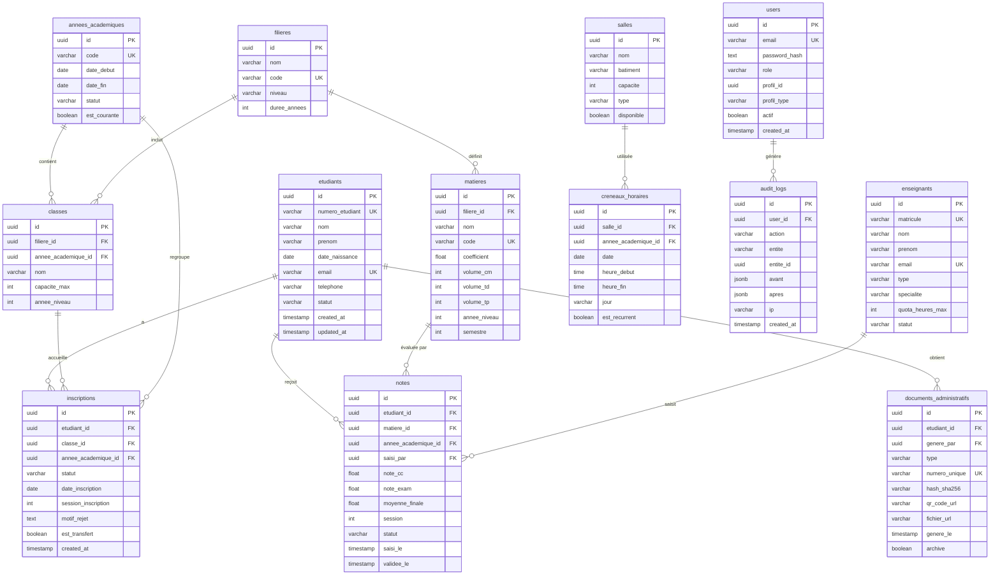

### Index recommandés

```sql
-- Performance critique
CREATE INDEX idx_inscriptions_etudiant ON inscriptions(etudiant_id, annee_academique_id);
CREATE INDEX idx_notes_etudiant_annee ON notes(etudiant_id, annee_academique_id);
CREATE INDEX idx_notes_matiere ON notes(matiere_id, session);
CREATE INDEX idx_creneaux_salle_date ON creneaux_horaires(salle_id, date);
CREATE INDEX idx_users_email ON users(email);
CREATE INDEX idx_etudiants_numero ON etudiants(numero_etudiant);
CREATE INDEX idx_audit_entite ON audit_logs(entite, entite_id);

-- Recherche full-text sur étudiants
CREATE INDEX idx_etudiants_search ON etudiants USING GIN(
  to_tsvector('french', nom || ' ' || prenom)
);
```

---

## 🚀 10. Roadmap MVP 2 Semaines {#roadmap}

### Plan jour par jour

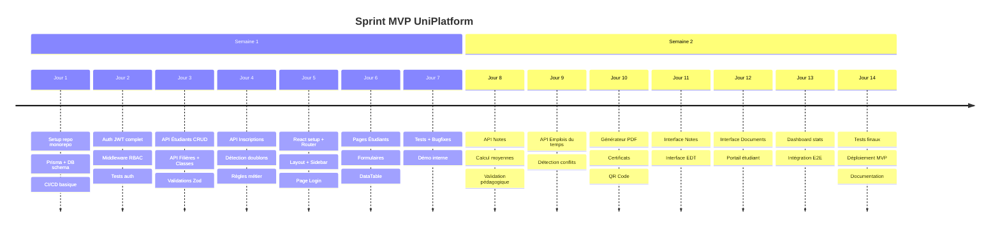

### Périmètre MVP vs V2

```mermaid
graph LR
    subgraph MVP["✅ MVP — 2 semaines"]
        style MVP fill:#22c55e,color:#fff
        M1["Auth multi-rôles"]
        M2["CRUD Étudiants"]
        M3["Inscriptions"]
        M4["Saisie Notes"]
        M5["Emploi du temps simple"]
        M6["Certificats PDF + QR"]
        M7["Portail étudiant (lecture)"]
        M8["Dashboard basique"]
    end

    subgraph V2["🔵 V2 — Mois 2-3"]
        style V2 fill:#3b82f6,color:#fff
        V2a["Gestion Chambres"]
        V2b["Soutenances + Jury"]
        V2c["Notifications email/SMS"]
        V2d["Import Excel"]
        V2e["Statistiques avancées"]
        V2f["Workflow délibération"]
    end

    subgraph V3["🟣 V3 — Mois 4+"]
        style V3 fill:#8b5cf6,color:#fff
        V3a["Paiement en ligne"]
        V3b["Badge numérique"]
        V3c["Signature électronique"]
        V3d["LMS intégration"]
        V3e["API externe"]
        V3f["Mobile app native"]
    end

    MVP --> V2 --> V3
```

---

## 🛠️ 11. Stack Technologique {#stack}

### Stack complète

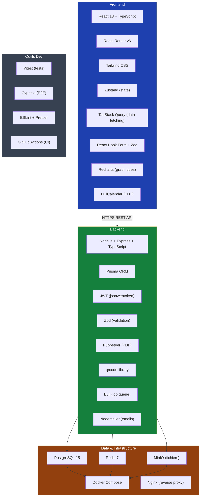

### Justification des choix

| Choix | Alternative écartée | Raison |
|---|---|---|
| **Prisma** | Sequelize, Knex | Typage TypeScript natif, migrations sûres |
| **Zustand** | Redux | Moins de boilerplate pour MVP |
| **TanStack Query** | SWR, Axios seul | Cache, pagination, mutations intégrées |
| **Zod** | Joi, Yup | Shared entre front et back, TypeScript-first |
| **Puppeteer** | PDFKit, jsPDF | Rendu HTML → PDF fidèle au template |
| **Bull + Redis** | Agenda, node-cron | Queue fiable pour PDF/emails async |
| **PostgreSQL** | MongoDB | Données fortement relationnelles, ACID |
| **FullCalendar** | react-big-calendar | Plus complet pour emploi du temps complexe |

---

## 🔒 Considérations Sécurité

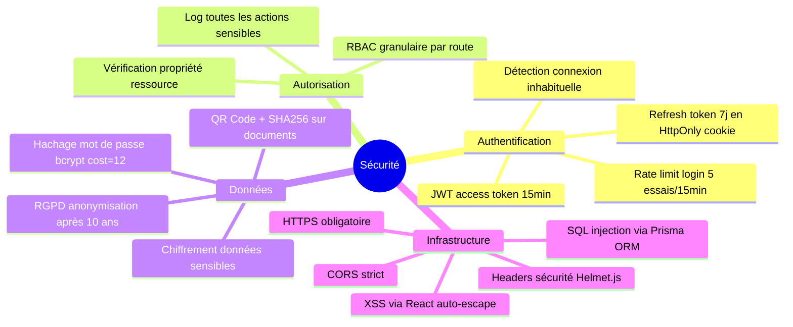

---

## 📊 Récapitulatif

| Dimension | Décision |
|---|---|
| **Durée MVP** | 2 semaines (14 jours) |
| **Frontend** | React 18 + TypeScript + Tailwind |
| **Backend** | Node.js + Express + Prisma |
| **Base de données** | PostgreSQL + Redis |
| **Auth** | JWT + Refresh Token + RBAC |
| **PDF** | Puppeteer + QR Code + SHA256 |
| **Déploiement** | Docker Compose + Nginx |
| **Tests** | Vitest (unit) + Cypress (E2E) |
| **Modules MVP** | Auth, Étudiants, Inscriptions, Notes, EDT, Documents |
| **Zones d'ombre couvertes** | Doublons, statuts complexes, sessions multiples, traçabilité, RGPD |

> **💡 Conseil clé :** Priorisez la solidité du modèle de données dès le départ. Une mauvaise conception des entités `Note` (sans session, sans statut provisoire/validé) ou `Inscription` (sans historique de transfert) sera très coûteuse à corriger en V2.
