# 🎓 UniCore — Conception Complète de la Plateforme Universitaire

> **Version :** 1.0 · **Méthode :** Agile (Scrum) · **Statut :** Document de conception initial

---

## 🗺️ Table des matières

1. [Vision produit](#vision)
2. [Architecture système](#architecture)
3. [Modèle de données — Entités clés](#entites)
4. [Zones d'ombre & angles morts](#zones-ombre)
5. [Backlog agile — Sprints](#backlog)
6. [Stack technologique](#stack)
7. [Diagramme de flux utilisateur](#flux)
8. [Sécurité & conformité](#securite)

---

## 🎯 1. Vision Produit {#vision}

> **UniCore** est une plateforme SaaS multi-tenant dédiée aux établissements d'enseignement supérieur, centralisant l'ensemble du cycle de vie académique, administratif et logistique.

### Proposition de valeur

| 👤 Acteur | 🔴 Problème actuel | ✅ Solution UniCore |
|---|---|---|
| Étudiant | Déplacements multiples pour documents | Portail self-service 24/7 |
| Enseignant | Saisie des notes en double | Interface unifiée + import Excel |
| Scolarité | Excel fragiles, données dupliquées | Base unique + workflows automatisés |
| Direction | Aucune visibilité temps réel | Dashboard analytique live |
| DSI | Systèmes isolés non interconnectés | API REST ouverte + webhooks |

---

## 🏗️ 2. Architecture Système {#architecture}

### Vue d'ensemble macro

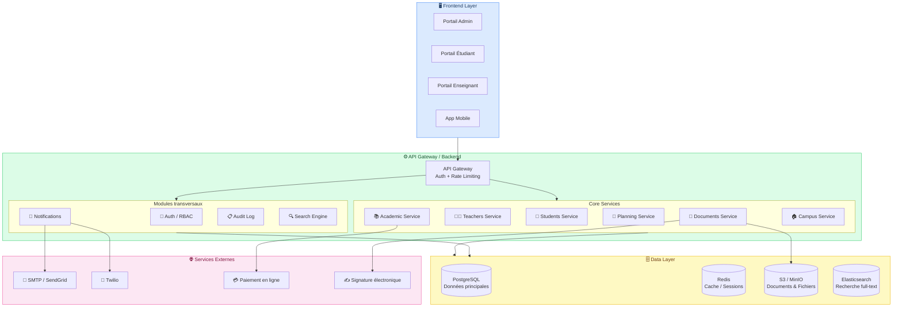

### Architecture base de données (multi-tenant)

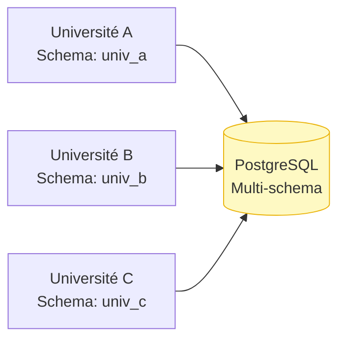

> **Stratégie multi-tenant :** Un schema PostgreSQL par établissement → isolation des données, migrations indépendantes, facturation à l'usage.

---

## 🗃️ 3. Modèle de Données — Entités Clés {#entites}

### ERD simplifié — Cœur académique

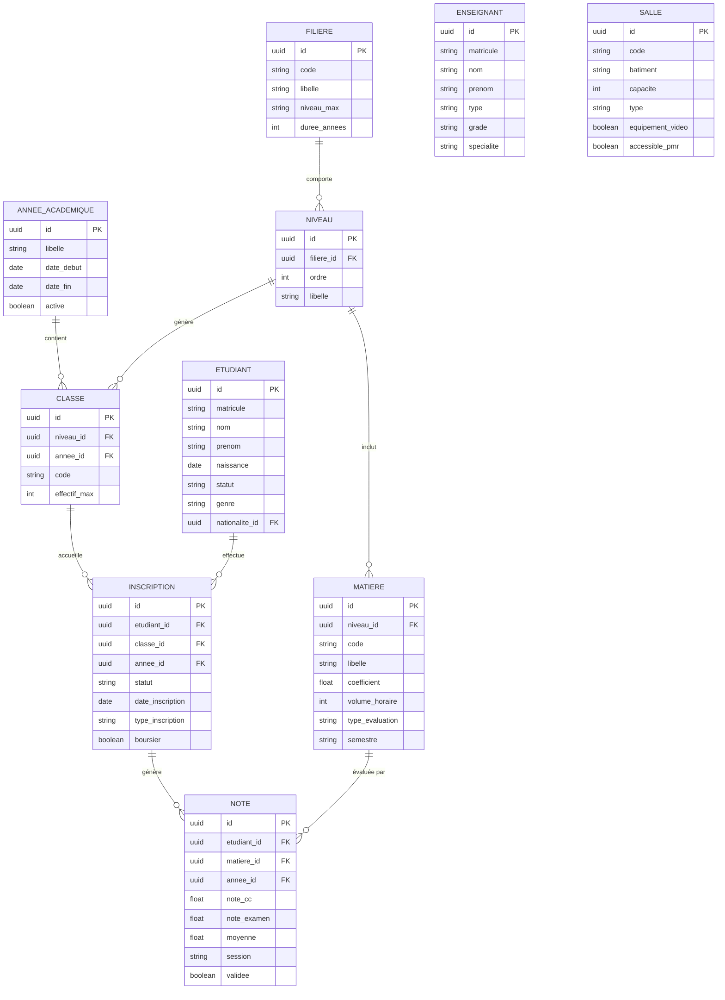

### ERD — Planning & Campus

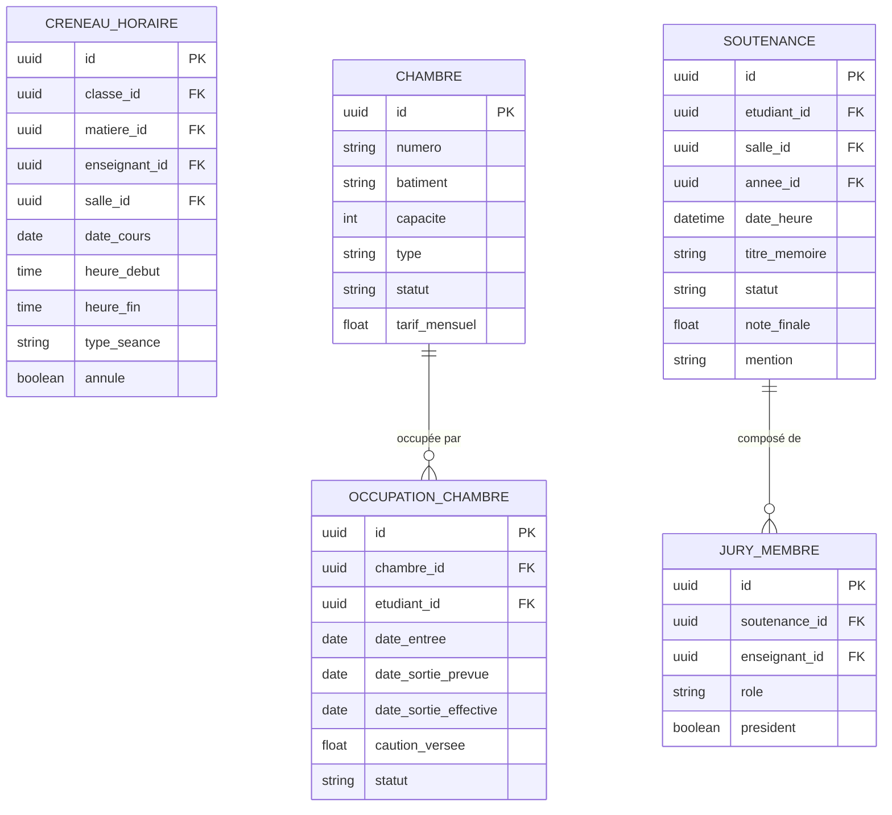

---

## ⚠️ 4. Zones d'Ombre & Angles Morts {#zones-ombre}

> **🔴 Ce sont les situations que votre document original n'a PAS anticipées.** Chacune peut bloquer le projet en production.

### 4.1 — Entités manquantes ou sous-spécifiées

#### 🔴 CRITIQUE — La nationalité et les étudiants étrangers

Vous n'avez pas prévu :
- Suivi du **titre de séjour / visa étudiant** (date d'expiration, alertes)
- **Équivalences de diplômes** étrangers pour l'admission
- Documents spécifiques pour étudiants hors UE/UEMOA

#### 🔴 CRITIQUE — Les groupes de TD/TP

La classe est une unité trop grosse. En réalité :
- Une classe de 80 étudiants se divise en **groupes de TD** (20-25)
- Les **groupes de TP** peuvent être différents des groupes de TD
- Un étudiant peut changer de groupe (chirurgie, échange, redoublement partiel)

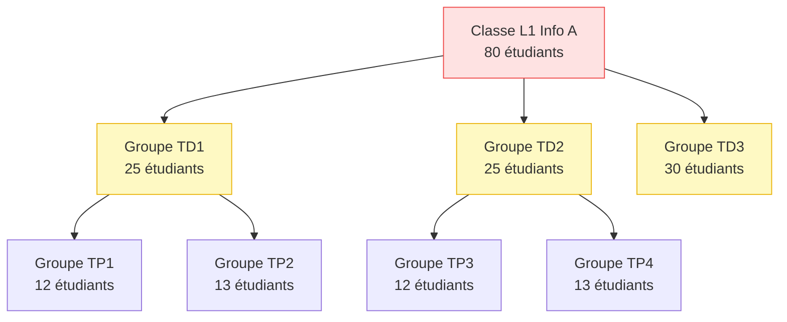

#### 🟠 IMPORTANT — Les sessions d'examen

Vous avez les notes mais pas la **session** structurée :
- Session normale vs session de rattrapage
- Dates d'ouverture/fermeture de saisie des notes
- Clôture de session par le responsable pédagogique
- Archivage après délibération (notes immuables)

#### 🟠 IMPORTANT — Les transferts et mobilités

Situations non modélisées :
- **Transfert entrant** (étudiant venant d'une autre université)
- **Transfert sortant**
- **Changement de filière** en cours d'année
- **Interruption temporaire** (congé maternité, maladie longue durée)
- **Étudiant en double inscription** (formation continue + initiale)

#### 🟡 À PRÉVOIR — Les frais et paiements

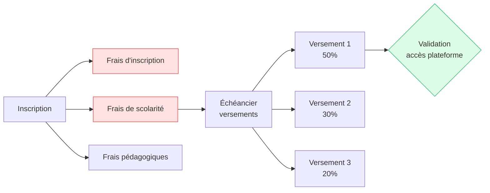

Sans module de paiement, la plateforme ne peut pas **conditionner l'accès** aux services (notes, emplois du temps) au règlement des frais.

#### 🟡 À PRÉVOIR — Le parcours pédagogique individualisé

Vous traitez tous les étudiants uniformément. Or :
- Un étudiant **redoublant partiellement** ne suit que certaines matières
- Un étudiant en **validation d'acquis** (VAE/VAP) peut être dispensé de certains modules
- Un étudiant en **stage long** a un emploi du temps spécifique

#### 🟡 À PRÉVOIR — Les conventions et partenariats

Non traités :
- **Conventions de stage** (entreprise, durée, tuteur)
- **Conventions d'échange** Erasmus / bilatérales
- **Entreprises partenaires** pour alternance
- **Tuteurs professionnels** (non enseignants, mais évaluateurs)

### 4.2 — Situations opérationnelles non anticipées

| ❓ Situation | ⚡ Impact | 💡 Solution recommandée |
|---|---|---|
| Enseignant absent en urgence | Cours annulé sans prévenir → conflit emploi du temps | Système de remplacement + notification push |
| Délibération contestée | Modification de note après clôture | Workflow de demande de révision avec double validation |
| Deux étudiants homonymes | Confusion de dossiers | Matricule unique + photo obligatoire |
| Soutenance reportée en urgence | Jury partiellement présent | Seuil minimum de jury + report automatique |
| Diplôme non retiré après 2 ans | Stockage physique, espace perdu | Statut "diplôme en attente" + relances automatiques |
| Étudiant décédé | Dossier bloqué dans le système | Statut "archivé - décès" + procédure famille |
| Coupure réseau lors de saisie notes | Perte de données | Auto-save local (IndexedDB) + sync à la reconnexion |
| Changement de responsable pédagogique | Accès perdus / doublons | Transfert de rôle avec historique |

### 4.3 — Entités manquantes dans votre modèle

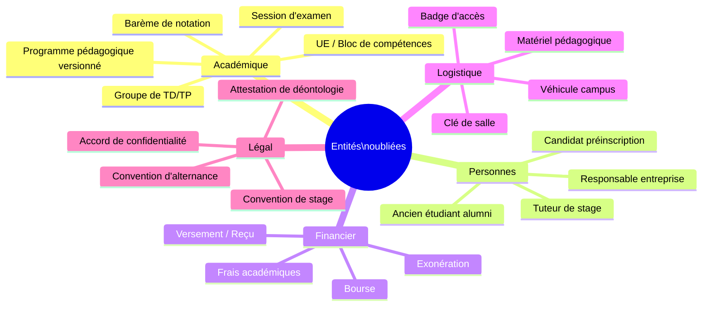

---

## 🏃 5. Backlog Agile — Conception par Sprints {#backlog}

### Roadmap globale

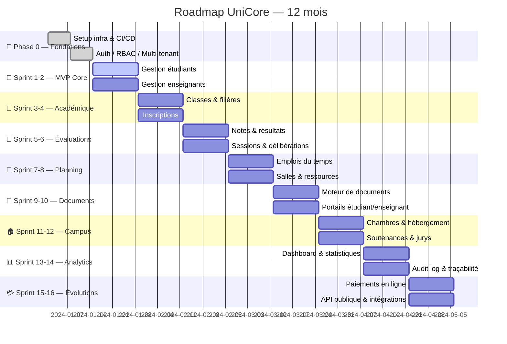

### Détail Sprint 1 & 2 — MVP (exemple)

| # | User Story | Priorité | Points | Acceptance Criteria |
|---|---|---|---|---|
| US-001 | En tant qu'admin, je peux créer un dossier étudiant | 🔴 Must | 5 | Matricule auto-généré, champs obligatoires validés |
| US-002 | En tant qu'étudiant, je peux me connecter avec mon email | 🔴 Must | 3 | JWT, 2FA optionnel, reset password |
| US-003 | En tant que scolarité, je peux importer une liste CSV d'étudiants | 🔴 Must | 8 | Validation colonnes, rapport d'erreurs, rollback si échec |
| US-004 | En tant qu'admin, je peux créer un profil enseignant | 🔴 Must | 5 | Type permanent/vacataire, spécialité, documents |
| US-005 | En tant qu'admin, je peux créer des filières et niveaux | 🔴 Must | 3 | Arborescence filière > niveau > option |
| US-006 | En tant qu'admin, je peux créer une classe pour une année académique | 🔴 Must | 3 | Rattachement filière/niveau, capacité max |
| US-007 | En tant que scolarité, je peux inscrire un étudiant dans une classe | 🟠 Should | 5 | Vérification capacité, statut inscription, historique |
| US-008 | En tant qu'enseignant, je peux saisir les notes d'une matière | 🟠 Should | 8 | Grille de saisie, calcul auto, sauvegarde brouillon |
| US-009 | En tant qu'admin, je peux générer un certificat de scolarité PDF | 🟠 Should | 8 | Template personnalisable, numérotation, signature |
| US-010 | En tant que direction, je vois un tableau de bord des effectifs | 🟡 Could | 5 | Graphiques par filière, export Excel |

### Définition of Done (DoD)

> ✅ Code revu par un pair  
> ✅ Tests unitaires ≥ 80% couverture  
> ✅ Tests E2E sur le happy path  
> ✅ Documentation API (Swagger)  
> ✅ Testé sur mobile (responsive)  
> ✅ Validé par le Product Owner  
> ✅ Déployé en staging  

---

## 💻 6. Stack Technologique {#stack}

### Vue d'ensemble de la stack

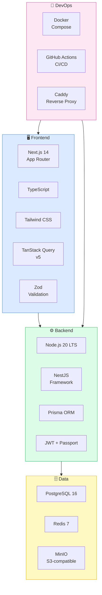

### Justification des choix

| Technologie | Rôle | Pourquoi ce choix |
|---|---|---|
| **Next.js 14** | Frontend SSR/SPA | SEO, performance, routing puissant, Server Actions |
| **NestJS** | Backend API | Architecture modulaire, DI, compatible microservices |
| **PostgreSQL** | Base principale | ACID, JSON natif, Row-Level Security pour multi-tenant |
| **Prisma** | ORM | Type-safe, migrations versionnées, excellent DX |
| **Redis** | Cache + Sessions | Rate limiting, file de jobs (Bull), sessions |
| **MinIO** | Stockage fichiers | Self-hosted, compatible S3, gratuit |
| **BullMQ** | Queue de jobs | Génération PDF asynchrone, envoi emails en masse |
| **Puppeteer** | Génération PDF | Templates HTML → PDF haute qualité |
| **Zod** | Validation | Schemas partagés front/back, type inference |

### Alternatives considérées

| Besoin | Option retenue | Alternative écartée | Raison |
|---|---|---|---|
| ORM | Prisma | TypeORM | Meilleure DX, types auto-générés |
| Framework backend | NestJS | Express nu | Structure, modules, testabilité |
| PDF | Puppeteer | PDFKit | Templates HTML plus flexibles |
| Auth | Passport + JWT | Auth0 / Clerk | Coût + souveraineté des données |
| Recherche | PostgreSQL full-text | Elasticsearch | Suffisant pour v1, moins de complexité |

---

## 🔄 7. Diagramme de Flux Utilisateur {#flux}

### Flux d'inscription étudiant

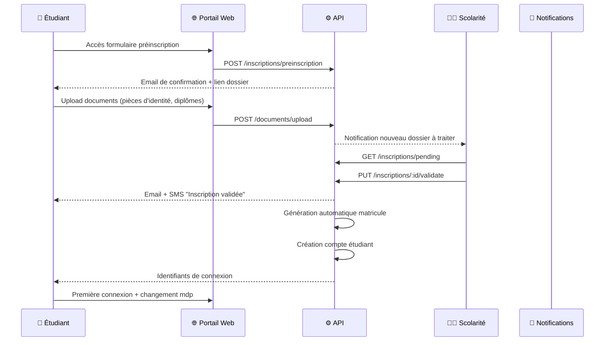

### Flux de saisie et validation des notes

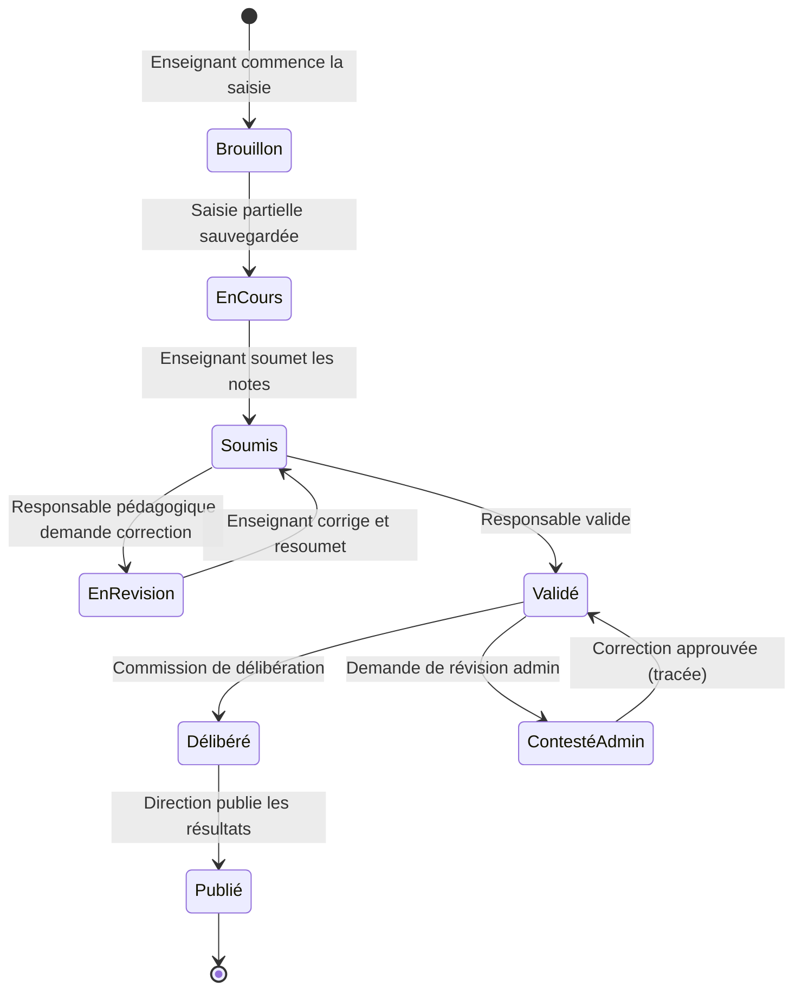

### Diagramme de rôles et permissions

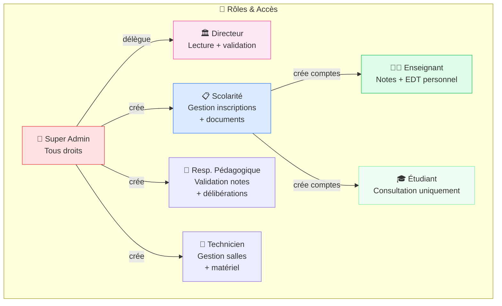

---

## 🔒 8. Sécurité & Conformité {#securite}

### Checklist sécurité

| Domaine | Mesure | Priorité |
|---|---|---|
| **Authentification** | JWT RS256 + refresh tokens rotatifs | 🔴 MVP |
| **Autorisation** | RBAC + Row-Level Security PostgreSQL | 🔴 MVP |
| **Transport** | HTTPS obligatoire, HSTS | 🔴 MVP |
| **Mots de passe** | bcrypt (cost 12) + politique de complexité | 🔴 MVP |
| **Audit** | Toute action tracée (qui, quoi, quand, depuis où) | 🟠 Sprint 2 |
| **RGPD / Données perso** | Droit à l'effacement, export des données | 🟠 Sprint 3 |
| **Rate limiting** | 100 req/min par IP, 1000 req/min par token | 🟠 Sprint 2 |
| **Upload fichiers** | Scan antivirus, type MIME strict, taille max | 🟠 Sprint 2 |
| **Sauvegarde** | Backup quotidien chiffré, rétention 30 jours | 🟠 Sprint 1 |
| **2FA** | TOTP optionnel pour admins, obligatoire super admin | 🟡 Sprint 4 |
| **Chiffrement données** | Données sensibles chiffrées at-rest (AES-256) | 🟡 Sprint 4 |

### Points de vigilance spécifiques aux universités

> ⚠️ **FERPA / Réglementations locales** : Vérifier la législation de votre pays sur la protection des données des étudiants mineurs.

> ⚠️ **Notes = données légales** : Une modification de note après délibération doit être **impossible** sans workflow de validation explicite et **traçabilité complète** (qui a demandé, qui a approuvé, horodatage NTP certifié).

> ⚠️ **Documents officiels** : Les certificats et relevés doivent avoir un **numéro unique vérifiable** et idéalement un **QR code** permettant leur authentification en ligne.

---

## 🚀 Prochaines étapes recommandées

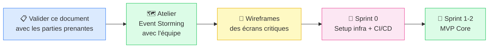

---

*Document généré avec UniCore Design System · Dernière mise à jour : 2026*
