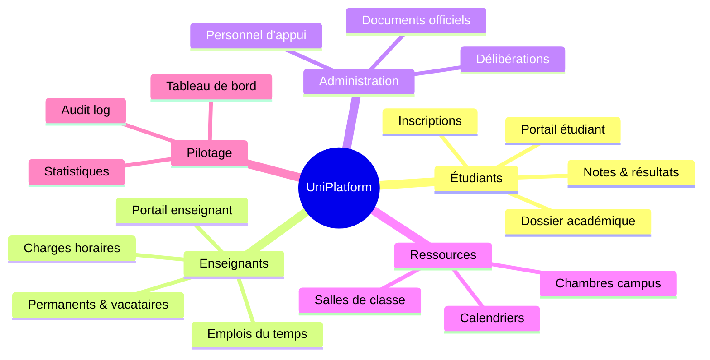
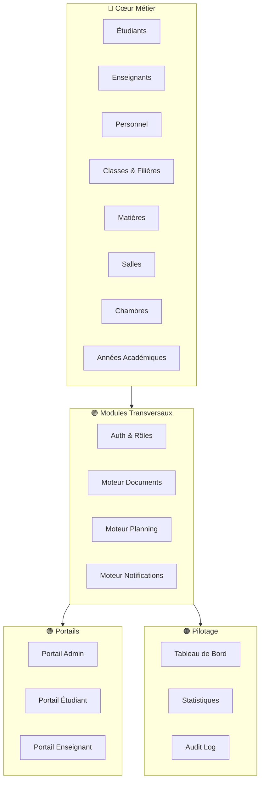
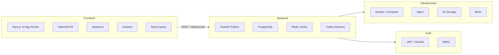
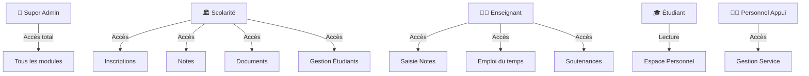
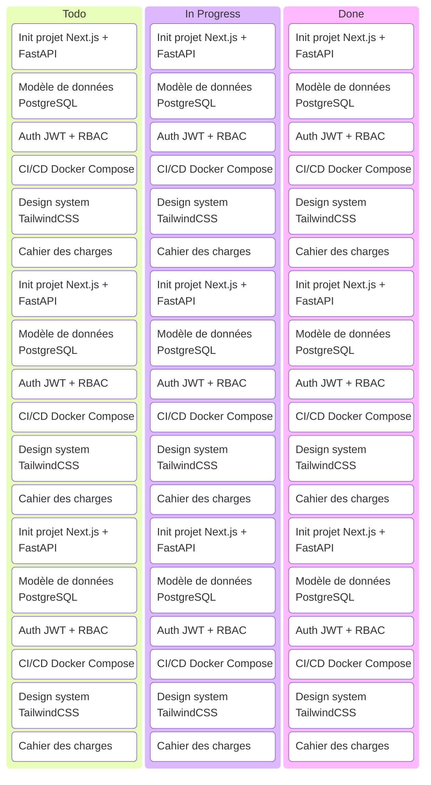
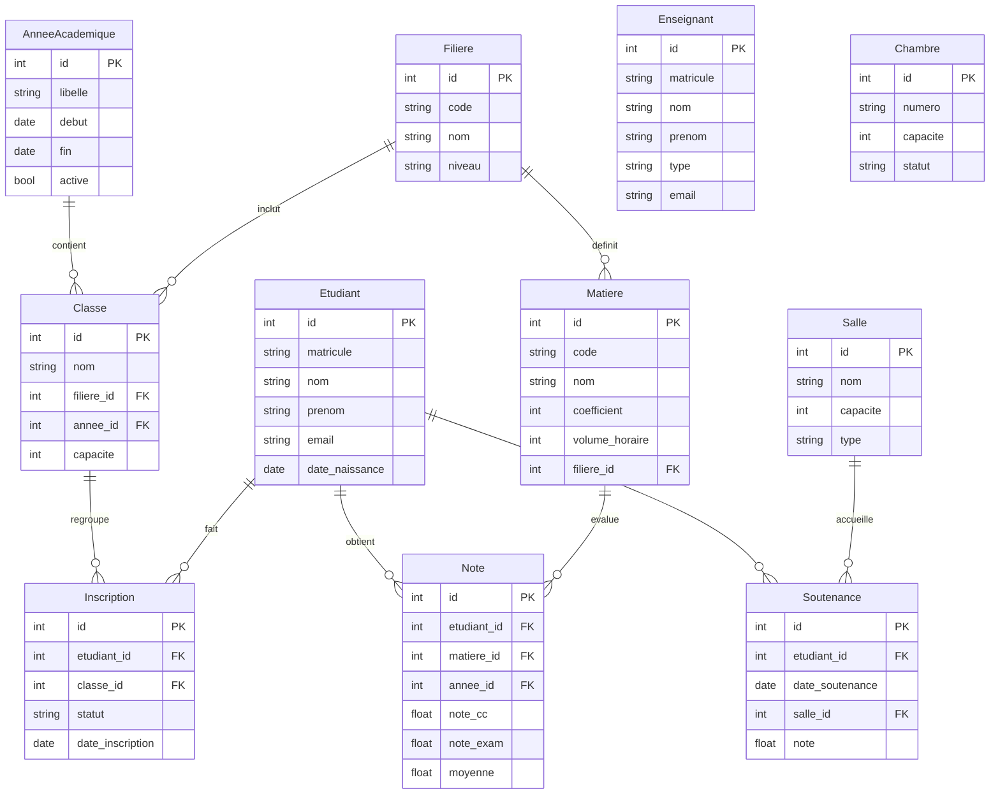
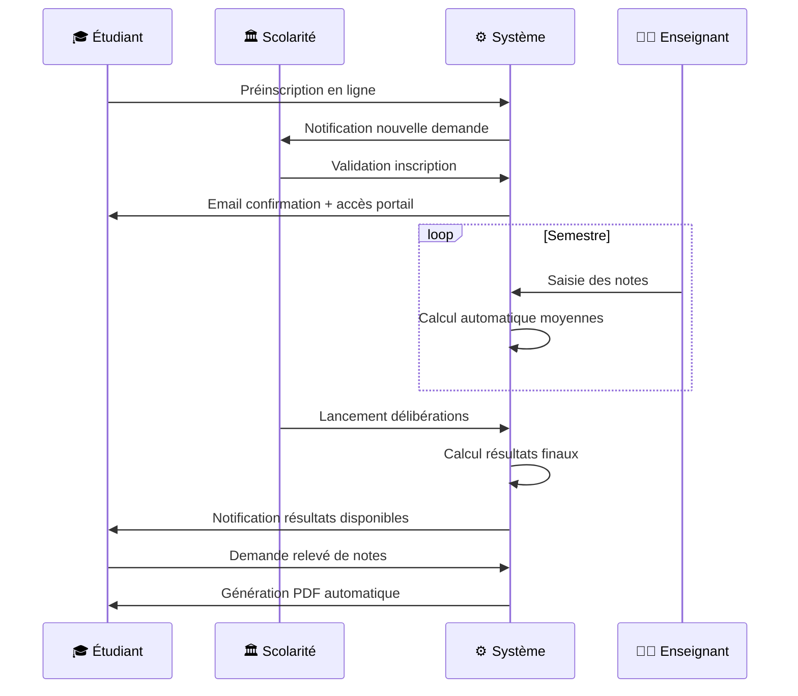
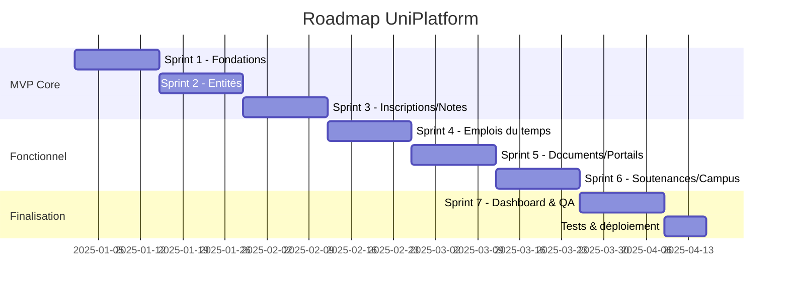
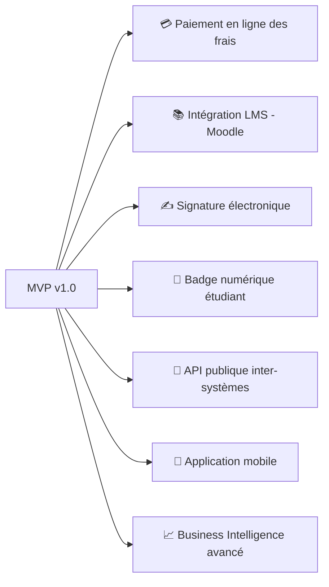

# 🎓 UniPlatform — Conception & Architecture du Projet

> **Plateforme unifiée de gestion universitaire**  
> *Académique · Administratif · Logistique*

---

## 🗺️ Vue d'ensemble



---

## 🏗️ Architecture fonctionnelle



---

## 🛠️ Stack Technologique



### Tableau récapitulatif

| Couche | Technologie | Rôle |
|---|---|---|
| **Frontend** | Next.js 14 + TypeScript | Interface utilisateur, SSR/SSG |
| **UI/UX** | TailwindCSS + shadcn/ui | Design system cohérent |
| **État client** | Zustand + React Query | State management + cache |
| **API** | FastAPI (Python) | REST API performante, auto-docs |
| **ORM** | SQLAlchemy + Alembic | Modèles DB + migrations |
| **Base de données** | PostgreSQL 16 | Données relationnelles |
| **Cache** | Redis | Sessions, cache API, queues |
| **Workers** | Celery + Redis | Tâches async (PDF, emails...) |
| **Documents** | WeasyPrint / Jinja2 | Génération PDF |
| **Stockage** | Minio (compatible S3) | Fichiers, documents générés |
| **Auth** | JWT + OAuth2 + RBAC | Auth sécurisée multi-rôles |
| **Infra** | Docker + Nginx | Déploiement containerisé |

---

## 👥 Rôles & Permissions



---

## 🚀 Planification Agile — Sprints

### 🔴 Sprint 1 — Fondations (Semaine 1-2) `MVP Core`



**Livrables Sprint 1 :**
- Architecture DB définie (schéma Postgres)
- Auth + gestion des rôles fonctionnelle
- Environnement de développement prêt

---

### 🟡 Sprint 2 — Gestion des entités (Semaine 3-4) `MVP Core`

**User Stories :**

| ID | En tant que | Je veux | Priorité |
|---|---|---|---|
| US-01 | Admin | Créer/modifier un dossier étudiant | 🔴 High |
| US-02 | Admin | Gérer les enseignants permanents et vacataires | 🔴 High |
| US-03 | Admin | Créer filières, niveaux, classes | 🔴 High |
| US-04 | Admin | Rattacher étudiants à une classe | 🔴 High |
| US-05 | Admin | Consulter la liste des étudiants par classe | 🟡 Med |

---

### 🟡 Sprint 3 — Inscriptions & Notes (Semaine 5-6) `MVP Core`

**User Stories :**

| ID | En tant que | Je veux | Priorité |
|---|---|---|---|
| US-06 | Scolarité | Ouvrir une campagne d'inscription | 🔴 High |
| US-07 | Étudiant | Faire une préinscription en ligne | 🔴 High |
| US-08 | Scolarité | Valider / rejeter une inscription | 🔴 High |
| US-09 | Enseignant | Saisir les notes de ma matière | 🔴 High |
| US-10 | Système | Calculer les moyennes automatiquement | 🔴 High |
| US-11 | Scolarité | Générer les relevés de notes | 🟡 Med |

---

### 🟢 Sprint 4 — Emplois du temps & Salles (Semaine 7-8)

**User Stories :**

| ID | En tant que | Je veux | Priorité |
|---|---|---|---|
| US-12 | Admin | Gérer l'inventaire des salles | 🔴 High |
| US-13 | Admin | Créer l'emploi du temps d'une classe | 🔴 High |
| US-14 | Système | Détecter les conflits de planning | 🔴 High |
| US-15 | Étudiant | Consulter mon emploi du temps | 🟡 Med |
| US-16 | Enseignant | Consulter mon planning | 🟡 Med |

---

### 🔵 Sprint 5 — Documents & Portails (Semaine 9-10)

**User Stories :**

| ID | En tant que | Je veux | Priorité |
|---|---|---|---|
| US-17 | Scolarité | Générer automatiquement un certificat de scolarité | 🔴 High |
| US-18 | Étudiant | Télécharger mes documents depuis mon espace | 🔴 High |
| US-19 | Étudiant | Faire une demande de document en ligne | 🟡 Med |
| US-20 | Admin | Personnaliser les modèles de documents | 🟡 Med |

---

### 🟣 Sprint 6 — Soutenances & Campus (Semaine 11-12)

**User Stories :**

| ID | En tant que | Je veux | Priorité |
|---|---|---|---|
| US-21 | Admin | Planifier les soutenances | 🟡 Med |
| US-22 | Admin | Affecter jury, salles et rapporteurs | 🟡 Med |
| US-23 | Système | Générer le PV de soutenance | 🟡 Med |
| US-24 | Admin | Gérer les chambres du campus | 🟢 Low |
| US-25 | Admin | Affecter un étudiant à une chambre | 🟢 Low |

---

### ⚫ Sprint 7 — Dashboard & Finalisation (Semaine 13-14)

**User Stories :**

| ID | En tant que | Je veux | Priorité |
|---|---|---|---|
| US-26 | Direction | Voir les effectifs par filière | 🟡 Med |
| US-27 | Direction | Voir les taux de réussite | 🟡 Med |
| US-28 | Admin | Accéder au journal des actions (audit) | 🟡 Med |
| US-29 | Admin | Archiver une année académique | 🟢 Low |

---

## 📐 Schéma de la Base de Données (simplifié)



---

## 🔄 Flux principal — Cycle de vie étudiant



---

## 📦 Structure des modules API

```mermaid
graph TB
    API[FastAPI — /api/v1]

    API --> AUTH_R[/auth — login, refresh, logout]
    API --> ETU_R[/students — CRUD étudiants]
    API --> ENS_R[/teachers — CRUD enseignants]
    API --> INS_R[/enrollments — inscriptions]
    API --> NOTE_R[/grades — notes & résultats]
    API --> EDT_R[/schedules — emplois du temps]
    API --> SALLE_R[/rooms — salles]
    API --> DOC_R[/documents — génération docs]
    API --> SOUT_R[/defenses — soutenances]
    API --> DASH_R[/dashboard — stats & KPIs]
    API --> ADMIN_R[/admin — config & paramètres]
```

---

## 🗓️ Roadmap globale



---

## 📊 Critères de succès du MVP

| Indicateur | Cible |
|---|---|
| Temps de génération d'un document | < 2 secondes |
| Disponibilité de la plateforme | 99.5% |
| Couverture de tests API | ≥ 80% |
| Temps de réponse API (p95) | < 500ms |
| Support utilisateurs simultanés | 500+ |

---

## 🔮 Évolutions futures (Post-MVP)



---

*Document généré pour le projet UniPlatform — Version 1.0*  
*Architecture : Monolithique modulaire → Microservices (v2)*
